[doc]

# 图形绘制示例

## 流程图

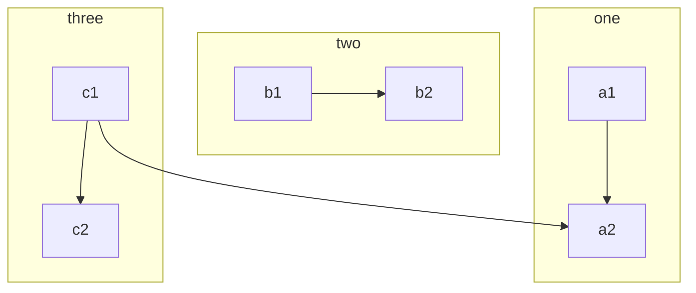

* * *

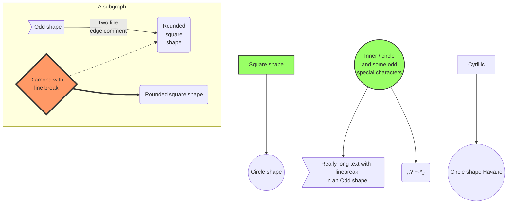

## 序列图

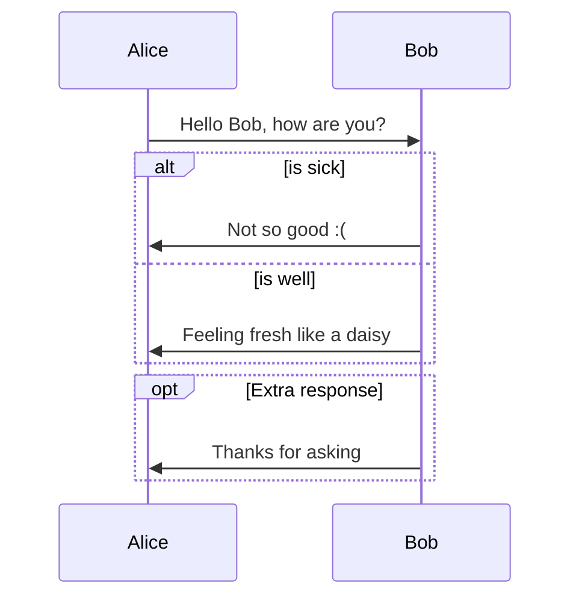

* * *

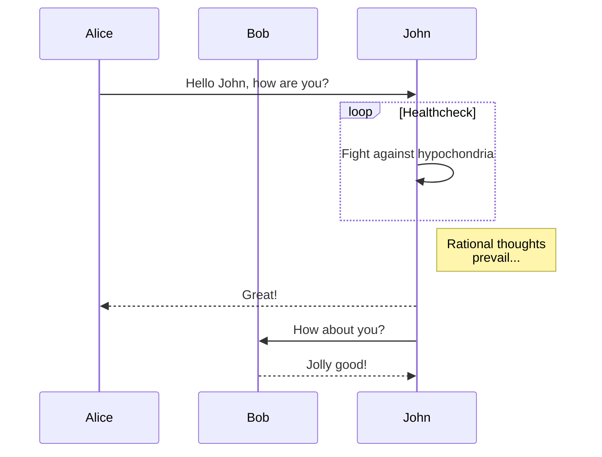

## 甘特图

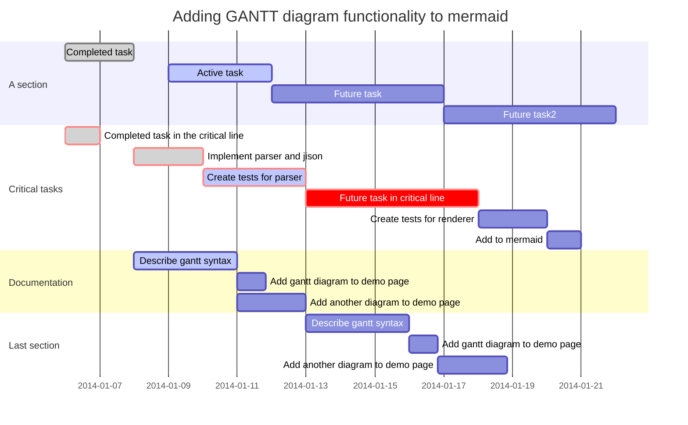

## 时序图

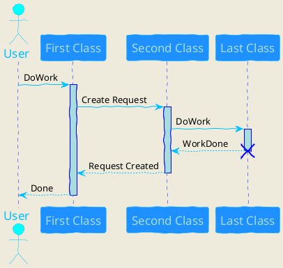

## 用例图

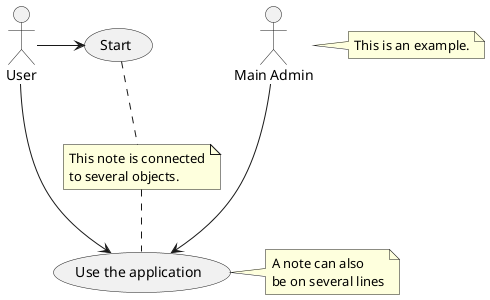

## 类图

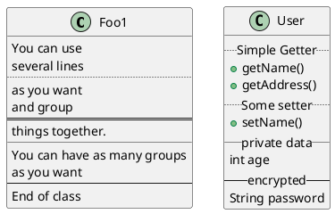

## 活动图

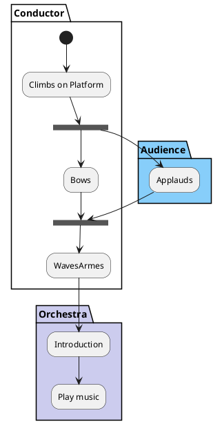

## 组件图

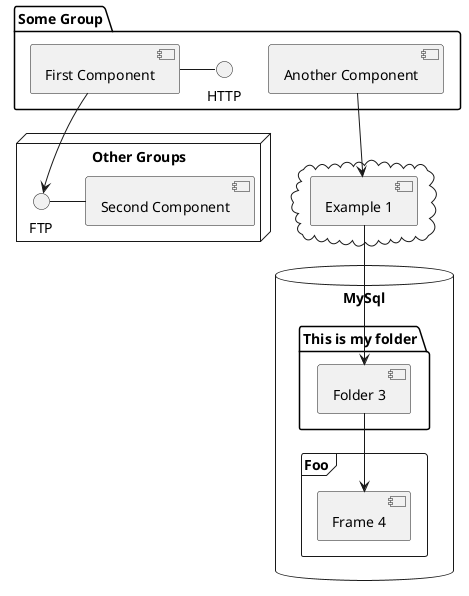

## 状态图

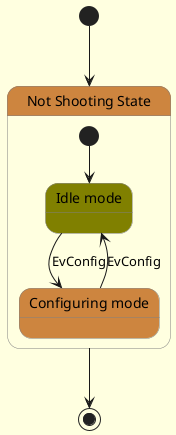

## 对象图

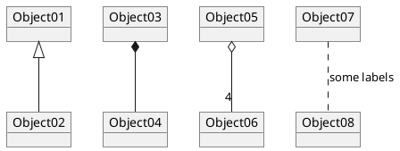

## 部署图

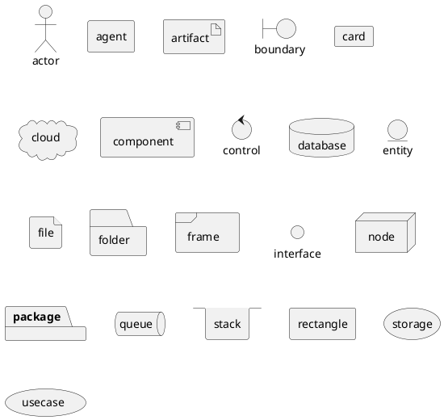

## 定时图

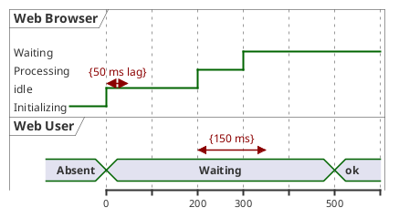

## dot

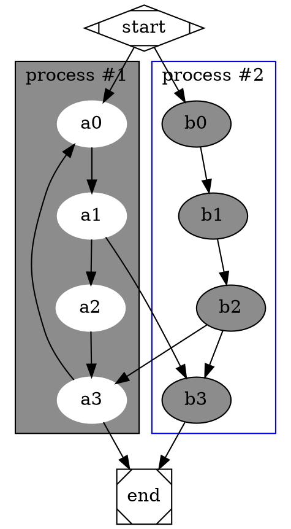

## WavedDrom

```WaveDrom
{ signal: [
  { name: "CK",   wave: "P.......",                                              period: 2  },
  { name: "CMD",  wave: "x.3x=x4x=x=x=x=x", data: "RAS NOP CAS NOP NOP NOP NOP", phase: 0.5 },
  { name: "ADDR", wave: "x.=x..=x........", data: "ROW COL",                     phase: 0.5 },
  { name: "DQS",  wave: "z.......0.1010z." },
  { name: "DQ",   wave: "z.........5555z.", data: "D0 D1 D2 D3" }
]}
```

## vega/vega-Lite

### 条形图

```vega-lite
{
  "$schema": "https://vega.github.io/schema/vega-lite/v3.json",
  "description": "A simple bar chart with embedded data.",
  "data": {
    "values": [
      {"a": "A","b": 28}, {"a": "B","b": 55}, {"a": "C","b": 43},
      {"a": "D","b": 91}, {"a": "E","b": 81}, {"a": "F","b": 53},
      {"a": "G","b": 19}, {"a": "H","b": 87}, {"a": "I","b": 52}
    ]
  },
  "mark": "bar",
  "encoding": {
    "x": {"field": "a", "type": "ordinal"},
    "y": {"field": "b", "type": "quantitative"}
  }
}
```

* * *

```vega
{
  "$schema": "resource/v5.json",
  "width": 300,
  "height": 240,
  "padding": 5,

  "data": [
    {
      "name": "table",
      "values": [
        {"category":"A", "position":0, "value":0.1},
        {"category":"A", "position":1, "value":0.6},
        {"category":"A", "position":2, "value":0.9},
        {"category":"A", "position":3, "value":0.4},
        {"category":"B", "position":0, "value":0.7},
        {"category":"B", "position":1, "value":0.2},
        {"category":"B", "position":2, "value":1.1},
        {"category":"B", "position":3, "value":0.8},
        {"category":"C", "position":0, "value":0.6},
        {"category":"C", "position":1, "value":0.1},
        {"category":"C", "position":2, "value":0.2},
        {"category":"C", "position":3, "value":0.7}
      ]
    }
  ],

  "scales": [
    {
      "name": "yscale",
      "type": "band",
      "domain": {"data": "table", "field": "category"},
      "range": "height",
      "padding": 0.2
    },
    {
      "name": "xscale",
      "type": "linear",
      "domain": {"data": "table", "field": "value"},
      "range": "width",
      "round": true,
      "zero": true,
      "nice": true
    },
    {
      "name": "color",
      "type": "ordinal",
      "domain": {"data": "table", "field": "position"},
      "range": {"scheme": "category20"}
    }
  ],

  "axes": [
    {"orient": "left", "scale": "yscale", "tickSize": 0, "labelPadding": 4, "zindex": 1},
    {"orient": "bottom", "scale": "xscale"}
  ],

  "marks": [
    {
      "type": "group",

      "from": {
        "facet": {
          "data": "table",
          "name": "facet",
          "groupby": "category"
        }
      },

      "encode": {
        "enter": {
          "y": {"scale": "yscale", "field": "category"}
        }
      },

      "signals": [
        {"name": "height", "update": "bandwidth('yscale')"}
      ],

      "scales": [
        {
          "name": "pos",
          "type": "band",
          "range": "height",
          "domain": {"data": "facet", "field": "position"}
        }
      ],

      "marks": [
        {
          "name": "bars",
          "from": {"data": "facet"},
          "type": "rect",
          "encode": {
            "enter": {
              "y": {"scale": "pos", "field": "position"},
              "height": {"scale": "pos", "band": 1},
              "x": {"scale": "xscale", "field": "value"},
              "x2": {"scale": "xscale", "value": 0},
              "fill": {"scale": "color", "field": "position"}
            }
          }
        },
        {
          "type": "text",
          "from": {"data": "bars"},
          "encode": {
            "enter": {
              "x": {"field": "x2", "offset": -5},
              "y": {"field": "y", "offset": {"field": "height", "mult": 0.5}},
              "fill": {"value": "white"},
              "align": {"value": "right"},
              "baseline": {"value": "middle"},
              "text": {"field": "datum.value"}
            }
          }
        }
      ]
    }
  ]
}
```

## 饼状图

```vega
{
  "$schema": "resource/v5.json",
  "width": 200,
  "height": 200,
  "autosize": "none",

  "signals": [
    {
      "name": "startAngle", "value": 0,
      "bind": {"input": "range", "min": 0, "max": 6.29, "step": 0.01}
    },
    {
      "name": "endAngle", "value": 6.29,
      "bind": {"input": "range", "min": 0, "max": 6.29, "step": 0.01}
    },
    {
      "name": "padAngle", "value": 0,
      "bind": {"input": "range", "min": 0, "max": 0.1}
    },
    {
      "name": "innerRadius", "value": 0,
      "bind": {"input": "range", "min": 0, "max": 90, "step": 1}
    },
    {
      "name": "cornerRadius", "value": 0,
      "bind": {"input": "range", "min": 0, "max": 10, "step": 0.5}
    },
    {
      "name": "sort", "value": false,
      "bind": {"input": "checkbox"}
    }
  ],

  "data": [
    {
      "name": "table",
      "values": [
        {"id": 1, "field": 4},
        {"id": 2, "field": 6},
        {"id": 3, "field": 10},
        {"id": 4, "field": 3},
        {"id": 5, "field": 7},
        {"id": 6, "field": 8}
      ],
      "transform": [
        {
          "type": "pie",
          "field": "field",
          "startAngle": {"signal": "startAngle"},
          "endAngle": {"signal": "endAngle"},
          "sort": {"signal": "sort"}
        }
      ]
    }
  ],

  "scales": [
    {
      "name": "color",
      "type": "ordinal",
      "domain": {"data": "table", "field": "id"},
      "range": {"scheme": "category20"}
    }
  ],

  "marks": [
    {
      "type": "arc",
      "from": {"data": "table"},
      "encode": {
        "enter": {
          "fill": {"scale": "color", "field": "id"},
          "x": {"signal": "width / 2"},
          "y": {"signal": "height / 2"}
        },
        "update": {
          "startAngle": {"field": "startAngle"},
          "endAngle": {"field": "endAngle"},
          "padAngle": {"signal": "padAngle"},
          "innerRadius": {"signal": "innerRadius"},
          "outerRadius": {"signal": "width / 2"},
          "cornerRadius": {"signal": "cornerRadius"}
        }
      }
    }
  ]
}
```

### 折线图

```vega
{
  "$schema": "resource/v5.json",
  "width": 500,
  "height": 200,
  "padding": 5,

  "signals": [
    {
      "name": "interpolate",
      "value": "linear",
      "bind": {
        "input": "select",
        "options": [
          "basis",
          "cardinal",
          "catmull-rom",
          "linear",
          "monotone",
          "natural",
          "step",
          "step-after",
          "step-before"
        ]
      }
    }
  ],

  "data": [
    {
      "name": "table",
      "values": [
        {"x": 0, "y": 28, "c":0}, {"x": 0, "y": 20, "c":1},
        {"x": 1, "y": 43, "c":0}, {"x": 1, "y": 35, "c":1},
        {"x": 2, "y": 81, "c":0}, {"x": 2, "y": 10, "c":1},
        {"x": 3, "y": 19, "c":0}, {"x": 3, "y": 15, "c":1},
        {"x": 4, "y": 52, "c":0}, {"x": 4, "y": 48, "c":1},
        {"x": 5, "y": 24, "c":0}, {"x": 5, "y": 28, "c":1},
        {"x": 6, "y": 87, "c":0}, {"x": 6, "y": 66, "c":1},
        {"x": 7, "y": 17, "c":0}, {"x": 7, "y": 27, "c":1},
        {"x": 8, "y": 68, "c":0}, {"x": 8, "y": 16, "c":1},
        {"x": 9, "y": 49, "c":0}, {"x": 9, "y": 25, "c":1}
      ]
    }
  ],

  "scales": [
    {
      "name": "x",
      "type": "point",
      "range": "width",
      "domain": {"data": "table", "field": "x"}
    },
    {
      "name": "y",
      "type": "linear",
      "range": "height",
      "nice": true,
      "zero": true,
      "domain": {"data": "table", "field": "y"}
    },
    {
      "name": "color",
      "type": "ordinal",
      "range": "category",
      "domain": {"data": "table", "field": "c"}
    }
  ],

  "axes": [
    {"orient": "bottom", "scale": "x"},
    {"orient": "left", "scale": "y"}
  ],

  "marks": [
    {
      "type": "group",
      "from": {
        "facet": {
          "name": "series",
          "data": "table",
          "groupby": "c"
        }
      },
      "marks": [
        {
          "type": "line",
          "from": {"data": "series"},
          "encode": {
            "enter": {
              "x": {"scale": "x", "field": "x"},
              "y": {"scale": "y", "field": "y"},
              "stroke": {"scale": "color", "field": "c"},
              "strokeWidth": {"value": 2}
            },
            "update": {
              "interpolate": {"signal": "interpolate"},
              "fillOpacity": {"value": 1}
            },
            "hover": {
              "fillOpacity": {"value": 0.5}
            }
          }
        }
      ]
    }
  ]
}
```

### 堆积面积图

```vega
{
  "$schema": "resource/v5.json",
  "width": 500,
  "height": 200,
  "padding": 5,

  "data": [
    {
      "name": "table",
      "values": [
        {"x": 0, "y": 28, "c":0}, {"x": 0, "y": 55, "c":1},
        {"x": 1, "y": 43, "c":0}, {"x": 1, "y": 91, "c":1},
        {"x": 2, "y": 81, "c":0}, {"x": 2, "y": 53, "c":1},
        {"x": 3, "y": 19, "c":0}, {"x": 3, "y": 87, "c":1},
        {"x": 4, "y": 52, "c":0}, {"x": 4, "y": 48, "c":1},
        {"x": 5, "y": 24, "c":0}, {"x": 5, "y": 49, "c":1},
        {"x": 6, "y": 87, "c":0}, {"x": 6, "y": 66, "c":1},
        {"x": 7, "y": 17, "c":0}, {"x": 7, "y": 27, "c":1},
        {"x": 8, "y": 68, "c":0}, {"x": 8, "y": 16, "c":1},
        {"x": 9, "y": 49, "c":0}, {"x": 9, "y": 15, "c":1}
      ],
      "transform": [
        {
          "type": "stack",
          "groupby": ["x"],
          "sort": {"field": "c"},
          "field": "y"
        }
      ]
    }
  ],

  "scales": [
    {
      "name": "x",
      "type": "point",
      "range": "width",
      "domain": {"data": "table", "field": "x"}
    },
    {
      "name": "y",
      "type": "linear",
      "range": "height",
      "nice": true, "zero": true,
      "domain": {"data": "table", "field": "y1"}
    },
    {
      "name": "color",
      "type": "ordinal",
      "range": "category",
      "domain": {"data": "table", "field": "c"}
    }
  ],

  "axes": [
    {"orient": "bottom", "scale": "x", "zindex": 1},
    {"orient": "left", "scale": "y", "zindex": 1}
  ],

  "marks": [
    {
      "type": "group",
      "from": {
        "facet": {
          "name": "series",
          "data": "table",
          "groupby": "c"
        }
      },
      "marks": [
        {
          "type": "area",
          "from": {"data": "series"},
          "encode": {
            "enter": {
              "interpolate": {"value": "monotone"},
              "x": {"scale": "x", "field": "x"},
              "y": {"scale": "y", "field": "y0"},
              "y2": {"scale": "y", "field": "y1"},
              "fill": {"scale": "color", "field": "c"}
            },
            "update": {
              "fillOpacity": {"value": 1}
            },
            "hover": {
              "fillOpacity": {"value": 0.5}
            }
          }
        }
      ]
    }
  ]
}
```

### 概率分布图

```vega
{
  "$schema": "resource/v5.json",
  "width": 500,
  "height": 100,
  "padding": 5,

  "signals": [
    { "name": "bandwidth", "value": 0,
      "bind": {"input": "range", "min": 0, "max": 0.1, "step": 0.001} },
    { "name": "steps", "value": 100,
      "bind": {"input": "range", "min": 10, "max": 500, "step": 1} },
    { "name": "method", "value": "pdf",
      "bind": {"input": "radio", "options": ["pdf", "cdf"]} }
  ],

  "data": [
    {
      "name": "points",
      "url": "data/normal-2d.json"
    },
    {
      "name": "summary",
      "source": "points",
      "transform": [
        {
          "type": "aggregate",
          "fields": ["u", "u"],
          "ops": ["mean", "stdev"],
          "as": ["mean", "stdev"]
        }
      ]
    },
    {
      "name": "density",
      "source": "points",
      "transform": [
        {
          "type": "density",
          "extent": {"signal": "domain('xscale')"},
          "steps": {"signal": "steps"},
          "method": {"signal": "method"},
          "distribution": {
            "function": "kde",
            "field": "u",
            "bandwidth": {"signal": "bandwidth"}
          }
        }
      ]
    },
    {
      "name": "normal",
      "transform": [
        {
          "type": "density",
          "extent": {"signal": "domain('xscale')"},
          "steps": {"signal": "steps"},
          "method": {"signal": "method"},
          "distribution": {
            "function": "normal",
            "mean": {"signal": "data('summary')[0].mean"},
            "stdev": {"signal": "data('summary')[0].stdev"}
          }
        }
      ]
    }
  ],

  "scales": [
    {
      "name": "xscale",
      "type": "linear",
      "range": "width",
      "domain": {"data": "points", "field": "u"},
      "nice": true
    },
    {
      "name": "yscale",
      "type": "linear",
      "range": "height", "round": true,
      "domain": {
        "fields": [
          {"data": "density", "field": "density"},
          {"data": "normal", "field": "density"}
        ]
      }
    },
    {
      "name": "color",
      "type": "ordinal",
      "domain": ["Normal Estimate", "Kernel Density Estimate"],
      "range": ["#444", "steelblue"]
    }
  ],

  "axes": [
    {"orient": "bottom", "scale": "xscale", "zindex": 1}
  ],

  "legends": [
    {"orient": "top-left", "fill": "color", "offset": 0, "zindex": 1}
  ],

  "marks": [
    {
      "type": "area",
      "from": {"data": "density"},
      "encode": {
        "update": {
          "x": {"scale": "xscale", "field": "value"},
          "y": {"scale": "yscale", "field": "density"},
          "y2": {"scale": "yscale", "value": 0},
          "fill": {"signal": "scale('color', 'Kernel Density Estimate')"}
        }
      }
    },
    {
      "type": "line",
      "from": {"data": "normal"},
      "encode": {
        "update": {
          "x": {"scale": "xscale", "field": "value"},
          "y": {"scale": "yscale", "field": "density"},
          "stroke": {"signal": "scale('color', 'Normal Estimate')"},
          "strokeWidth": {"value": 2}
        }
      }
    },
    {
      "type": "rect",
      "from": {"data": "points"},
      "encode": {
        "enter": {
          "x": {"scale": "xscale", "field": "u"},
          "width": {"value": 1},
          "y": {"value": 25, "offset": {"signal": "height"}},
          "height": {"value": 5},
          "fill": {"value": "steelblue"},
          "fillOpacity": {"value": 0.4}
        }
      }
    }
  ]
}
```

### 风矢量

```vega
{
  "$schema": "resource/v5.json",
  "width": 500,
  "padding": 5,

  "config": {
    "axisBand": {
      "bandPosition": 1,
      "tickExtra": true,
      "tickOffset": 0
    }
  },

  "signals": [
    { "name": "fields",
      "value": ["petalWidth", "petalLength", "sepalWidth", "sepalLength"] },
    { "name": "plotWidth", "value": 60 },
    { "name": "height", "update": "(plotWidth + 10) * length(fields)"},
    { "name": "bandwidth", "value": 0,
      "bind": {"input": "range", "min": 0, "max": 0.5, "step": 0.005} },
    { "name": "steps", "value": 100,
      "bind": {"input": "range", "min": 10, "max": 500, "step": 1} }
  ],

  "data": [
    {
      "name": "iris",
      "url": "data/iris.json",
      "transform": [
        {
          "type": "fold",
          "fields": {"signal": "fields"},
          "as": ["organ", "value"]
        }
      ]
    }
  ],

  "scales": [
    {
      "name": "layout",
      "type": "band",
      "range": "height",
      "domain": {"data": "iris", "field": "organ"}
    },
    {
      "name": "xscale",
      "type": "linear",
      "range": "width", "round": true,
      "domain": {"data": "iris", "field": "value"},
      "zero": true, "nice": true
    },
    {
      "name": "color",
      "type": "ordinal",
      "domain": {"data": "iris", "field": "organ"},
      "range": "category"
    }
  ],

  "axes": [
    {"orient": "bottom", "scale": "xscale", "zindex": 1},
    {"orient": "left", "scale": "layout", "tickCount": 5, "zindex": 1}
  ],

  "marks": [
    {
      "type": "group",
      "from": {
        "facet": {
          "data": "iris",
          "name": "organs",
          "groupby": "organ"
        }
      },

      "encode": {
        "enter": {
          "yc": {"scale": "layout", "field": "organ", "band": 0.5},
          "height": {"signal": "plotWidth"},
          "width": {"signal": "width"}
        }
      },

      "data": [
        {
          "name": "density",
          "transform": [
            {
              "type": "density",
              "steps": {"signal": "steps"},
              "distribution": {
                "function": "kde",
                "from": "organs",
                "field": "value",
                "bandwidth": {"signal": "bandwidth"}
              }
            },
            {
              "type": "stack",
              "groupby": ["value"],
              "field": "density",
              "offset": "center",
              "as": ["y0", "y1"]
            }
          ]
        },
        {
          "name": "summary",
          "source": "organs",
          "transform": [
            {
              "type": "aggregate",
              "fields": ["value", "value", "value"],
              "ops": ["q1", "median", "q3"],
              "as": ["q1", "median", "q3"]
            }
          ]
        }
      ],

      "scales": [
        {
          "name": "yscale",
          "type": "linear",
          "range": [0, {"signal": "plotWidth"}],
          "domain": {"data": "density", "field": "density"}
        }
      ],

      "marks": [
        {
          "type": "area",
          "from": {"data": "density"},
          "encode": {
            "enter": {
              "fill": {"scale": "color", "field": {"parent": "organ"}}
            },
            "update": {
              "x": {"scale": "xscale", "field": "value"},
              "y": {"scale": "yscale", "field": "y0"},
              "y2": {"scale": "yscale", "field": "y1"}
            }
          }
        },
        {
          "type": "rect",
          "from": {"data": "summary"},
          "encode": {
            "enter": {
              "fill": {"value": "black"},
              "height": {"value": 2}
            },
            "update": {
              "yc": {"signal": "plotWidth / 2"},
              "x": {"scale": "xscale", "field": "q1"},
              "x2": {"scale": "xscale", "field": "q3"}
            }
          }
        },
        {
          "type": "rect",
          "from": {"data": "summary"},
          "encode": {
            "enter": {
              "fill": {"value": "black"},
              "width": {"value": 2},
              "height": {"value": 8}
            },
            "update": {
              "yc": {"signal": "plotWidth / 2"},
              "x": {"scale": "xscale", "field": "median"}
            }
          }
        }
      ]
    }
  ]
}
```
