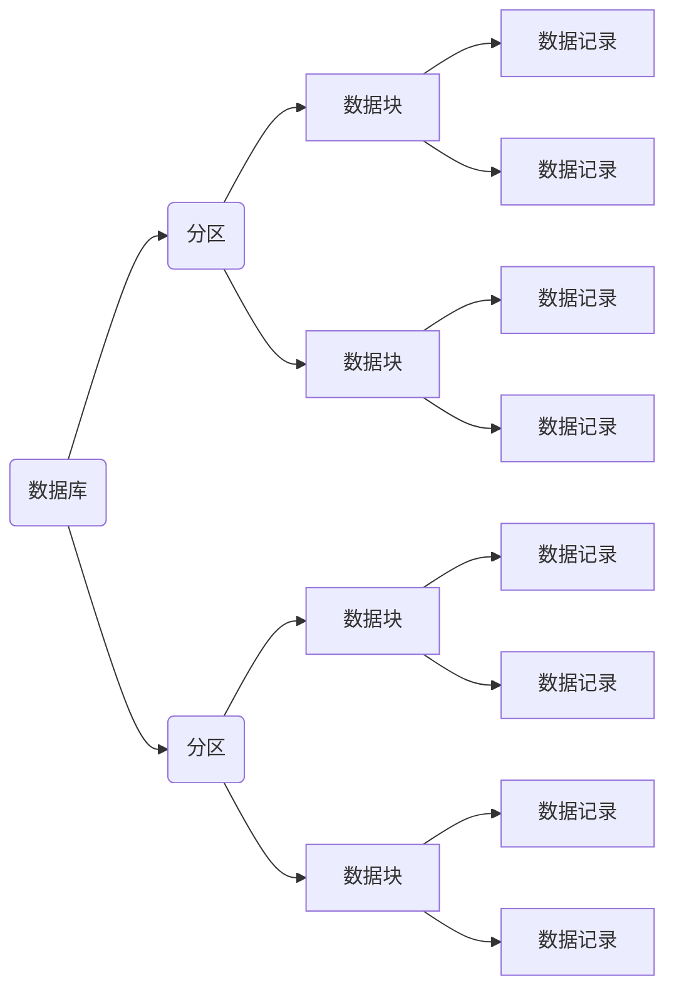

[toc]
# MySQL学习
## 级联操作
==注意：==
1. 存储引擎必须使用InnoDB引擎；
2. 外键必须建立索引；
3. 外键绑定关系这里使用了“ ON DELETE CASCADE ” “ON UPDATE CASCADE”，意思是如果外键对应数据被删除或者更新时，将关联数据完全删除或者相应地更新。更多信息请参考MySQL手册中关于InnoDB的文档；
### 1.建表时添加级联
```sql
create table stu(
-- UNSIGNED：无符号限定，非负限定
sid int UNSIGNED primary key auto_increment,
name varchar(20) not null
)ENGINE=INNODB charset=utf8;

-- CASCADE ON UPDATE级联更新
create table sc(
	scid int UNSIGNED primary key auto_increment,
	sid int UNSIGNED not null,
	score varchar(20) default '0',
	index (sid),   -- 外键必须加索引
	FOREIGN KEY (sid) REFERENCES stu(sid) ON DELETE CASCADE ON UPDATE CASCADE
	)ENGINE=INNODB charset=utf8;
```
### 建表后追加级联
```sql
-- 设定外键为级联删除就可以了。
alter table B add constraint fk_ID foreign key (ID) references A(ID) on delete cascade;
-- 设定外键为级联级联就可以了。
alter table B add constraint fk_ID foreign key (ID) references A(ID) on UPDATE cascade;
```
### 级联的劣势
- 这看来似乎很强大的样子，尤其是在网页编程的时候，就不用写这么多删除语句了，仅仅是删除一个主键，就能把所有涉及的项删除
- 但是，在你的工程足够的时候，这样的删除会很慢，实质上造成了表与表之间的耦合。远远比不删新增加一个isDel的项，使用标志删除的方式，查表的时候仅查询isDel=false的项。其实delete语句在网页的编程的时间根本就是可以扔掉的。这样还有个好处，出现在需要找被删除的旧数据的时候，绝对可以找回来。
- 这样你的网页的运行速度会大大加快，否则如果一旦执行级联删除的语句，会涉及的表足够多的时候，执行起来将会足够慢

# MySQL面试题
## 主键 超键 候选键 外键
- 主键：数据库表中对储存数据对象予以唯一和完整标识的数据列或属性的组合。一个数据列只能有一个主键，且主键的取值不能缺失，即不能为空值（Null）
- 超键：在关系中能唯一标识元组的属性集称为关系模式的超键。一个属性可以为作为一个超键，多个属性组合在一起也可以作为一个超键。超键包含候选键和主键
- 候选键：是最小超键，即没有冗余元素的超键
- 外键：在一个表中存在的另一个表的主键称此表的外键

## 数据库事务的四个特性及含义【ACID】
1. 原子性(Atomicity)：整个事务中的所有操作，要么全部完成，要么全部不完成，不可能停滞在中间某个环节。事务在执行过程中发生错误，会被回滚（Rollback）到事务开始前的状态，就像这个事务从来没有执行过一样
2. 一致性(Correspondence)：在事务开始之前和事务结束以后，数据库的完整性约束没有被破坏
3. 隔离性(Isolation)：隔离状态执行事务，使它们好像是系统在给定时间内执行的唯一操作。如果有两个事务，运行在相同的时间内，执行 相同的功能，事务的隔离性将确保每一事务在系统中认为只有该事务在使用系统。这种属性有时称为串行化，为了防止事务操作间的混淆，必须串行化或序列化请 求，使得在同一时间仅有一个请求用于同一数据
4. 持久性(Durability)：在事务完成以后，该事务所对数据库所作的更改便持久的保存在数据库之中，并不会被回滚

## 视图的作用，视图可以更改吗？
- 视图是虚拟的表，与包含数据的表不一样，视图只包含使用时动态检索数据的查询；不包含任何列或数据。使用视图可以简化复杂的sql操作，隐藏具体的细节，保护数据；视图创建后，可以使用与表相同的方式利用它们。
- 视图不能被索引，也不能有关联的触发器或默认值，如果视图本身内有order by 则对视图再次order by将被覆盖。
创建视图：create view XXX as XXXXXXXXXXXXXX;
- 对于某些视图比如未使用联结子查询分组聚集函数Distinct Union等，是可以对其更新的，对视图的更新将对基表进行更新；但是视图主要用于简化检索，保护数据，并不用于更新，而且大部分视图都不可以更新

## drop,delete与truncate的区别
drop直接删掉表 truncate删除表中数据，再插入时自增长id又从1开始 delete删除表中数据，可以加where字句
1. DELETE语句执行删除的过程是每次从表中删除一行，并且同时将该行的删除操作作为事务记录在日志中保存以便进行进行回滚操作。TRUNCATE TABLE 则一次性地从表中删除所有的数据并不把单独的删除操作记录记入日志保存，删除行是不能恢复的。并且在删除的过程中不会激活与表有关的删除触发器。执行速度快
2. 表和索引所占空间。当表被TRUNCATE 后，这个表和索引所占用的空间会恢复到初始大小，而DELETE操作不会减少表或索引所占用的空间。drop语句将表所占用的空间全释放掉
3. 一般而言，drop > truncate > delete
4. 应用范围。TRUNCATE 只能对TABLE；DELETE可以是table和view
5.  TRUNCATE 和DELETE只删除数据，而DROP则删除整个表（结构和数据）
6.  truncate与不带where的delete ：只删除数据，而不删除表的结构（定义）drop语句将删除表的结构被依赖的约束（constrain),触发器（trigger)索引（index);依赖于该表的存储过程/函数将被保留，但其状态会变为：invalid
7. delete语句为DML（data maintain Language),这个操作会被放到 rollback segment中,事务提交后才生效。如果有相应的 tigger,执行的时候将被触发
8.  truncate、drop是DLL（data define language),操作立即生效，原数据不放到 rollback segment中，不能回滚
9. 在没有备份情况下，谨慎使用 drop 与 truncate。要删除部分数据行采用delete且注意结合where来约束影响范围。回滚段要足够大。要删除表用drop;若想保留表而将表中数据删除，如果于事务无关，用truncate即可实现。如果和事务有关，或老师想触发trigger,还是用delete
10. Truncate table 表名 速度快,而且效率高,因为：truncate table 在功能上与不带 WHERE 子句的 DELETE 语句相同：二者均删除表中的全部行。但 TRUNCATE TABLE 比 DELETE 速度快，且使用的系统和事务日志资源少。DELETE 语句每次删除一行，并在事务日志中为所删除的每行记录一项。TRUNCATE TABLE 通过释放存储表数据所用的数据页来删除数据，并且只在事务日志中记录页的释放
11. TRUNCATE TABLE 删除表中的所有行，但表结构及其列、约束、索引等保持不变。新行标识所用的计数值重置为该列的种子。如果想保留标识计数值，请改用 DELETE。如果要删除表定义及其数据，请使用 DROP TABLE 语句
12. 对于由 FOREIGN KEY 约束引用的表，不能使用 TRUNCATE TABLE，而应使用不带 WHERE 子句的 DELETE 语句。由于 TRUNCATE TABLE 不记录在日志中，所以它不能激活触发器
## 索引的工作原理及其种类
- 数据库索引：是数据库管理系统中一个排序的数据结构，以协助快速查询、更新数据库表中数据。索引的实现通常使用B树及其变种B+树。
- 在数据之外，数据库系统还维护着满足特定查找算法的数据结构，这些数据结构以某种方式引用（指向）数据，这样就可以在这些数据结构上实现高级查找算法。这种数据结构，就是索引
- 为表设置索引要付出代价的：一是增加了数据库的存储空间，二是在插入和修改数据时要花费较多的时间(因为索引也要随之变动)

图展示了一种可能的索引方式。左边是数据表，一共有两列七条记录，最左边的是数据记录的物理地址（注意逻辑上相邻的记录在磁盘上也并不是一定物理相邻的）。为了加快Col2的查找，可以维护一个右边所示的二叉查找树，每个节点分别包含索引键值和一个指向对应数据记录物理地址的指针，这样就可以运用二叉查找在O(log2n)的复杂度内获取到相应数据
### 索引的优点
1. 通过创建唯一性索引，可以保证数据库表中每一行数据的唯一性
2. 可以大大加快数据的检索速度，这也是创建索引的最主要的原因
3. 可以加速表和表之间的连接，特别是在实现数据的参考完整性方面特别有意义
4. 在使用分组和排序子句进行数据检索时，同样可以显著减少查询中分组和排序的时间
5. 通过使用索引，可以在查询的过程中，使用优化隐藏器，提高系统的性能
### 索引的缺点
1. 创建索引和维护索引要耗费时间，这种时间随着数据量的增加而增加
2. 索引需要占物理空间，除了数据表占数据空间之外，每一个索引还要占一定的物理空间，如果要建立聚簇索引，那么需要的空间就会更大
3. 当对表中的数据进行增加、删除和修改的时候，索引也要动态的维护，这样就降低了数据的维护速度
### 索引规则
索引是建立在数据库表中的某些列的上面。在创建索引的时候，应该考虑在哪些列上可以创建索引，在哪些列上不能创建索引。一般来说，应该在这些列上创建索引：在经常需要搜索的列上，可以加快搜索的速度；在作为主键的列上，强制该列的唯一性和组织表中数据的排列结构；在经常用在连接的列上，这些列主要是一些外键，可以加快连接的速度；在经常需要根据范围进行搜索的列上创建索引，因为索引已经排序，其指定的范围是连续的；在经常需要排序的列上创建索引，因为索引已经排序，这样查询可以利用索引的排序，加快排序查询时间；在经常使用在WHERE子句中的列上面创建索引，加快条件的判断速度。
==同样，对于有些列不应该创建索引：==
1. ，对于那些在查询中很少使用或者参考的列不应该创建索引。这是因为，既然这些列很少使用到，因此有索引或者无索引，并不能提高查询速度。相反，由于增加了索引，反而降低了系统的维护速度和增大了空间需求
2. 对于那些只有很少数据值的列也不应该增加索引。这是因为，由于这些列的取值很少，例如人事表的性别列，在查询的结果中，结果集的数据行占了表中数据行的很大比例，即需要在表中搜索的数据行的比例很大。增加索引，并不能明显加快检索速度
3. 对于那些定义为text, image和bit数据类型的列不应该增加索引。这是因为，这些列的数据量要么相当大，要么取值很少
4. 当修改性能远远大于检索性能时，不应该创建索引。这是因为，修改性能和检索性能是互相矛盾的。当增加索引时，会提高检索性能，但是会降低修改性能。当减少索引时，会提高修改性能，降低检索性能。因此，当修改性能远远大于检索性能时，不应该创建索引
> 根据数据库的功能，可以在数据库设计器中创建三种索引：唯一索引、主键索引和聚集索引

### 索引种类
当现有数据中存在重复的键值时，大多数数据库不允许将新创建的唯一索引与表一起保存。数据库还可能防止添加将在表中创建重复键值的新数据。例如，如果在employee表中职员的姓(lname)上创建了唯一索引，则任何两个员工都不能同姓。
- 唯一索引是不允许其中任何两行具有相同索引值的索引
- 主键索引 数据库表经常有一列或列组合，其值唯一标识表中的每一行。该列称为表的主键。 在数据库关系图中为表定义主键将自动创建主键索引，主键索引是唯一索引的特定类型。该索引要求主键中的每个值都唯一。当在查询中使用主键索引时，它还允许对数据的快速访问。
- 聚集索引 在聚集索引中，表中行的物理顺序与键值的逻辑（索引）顺序相同。一个表只能包含一个聚集索引。如果某索引不是聚集索引，则表中行的物理顺序与键值的逻辑顺序不匹配。与非聚集索引相比，聚集索引通常提供更快的数据访问速度

### 局部性原理与磁盘预读
1. 由于存储介质的特性，磁盘本身存取就比主存慢很多，再加上机械运动耗费，磁盘的存取速度往往是主存的几百分分之一，因此为了提高效率，要尽量减少磁盘I/O。为了达到这个目的，磁盘往往不是严格按需读取，而是每次都会预读，即使只需要一个字节，磁盘也会从这个位置开始，顺序向后读取一定长度的数据放入内存。这样做的理论依据是计算机科学中著名的局部性原理：当一个数据被用到时，其附近的数据也通常会马上被使用。程序运行期间所需要的数据通常比较集中。
2. 由于磁盘顺序读取的效率很高（不需要寻道时间，只需很少的旋转时间），因此对于具有局部性的程序来说，预读可以提高I/O效率。
3. 预读的长度一般为页（page）的整倍数。页是计算机管理存储器的逻辑块，硬件及操作系统往往将主存和磁盘存储区分割为连续的大小相等的块，每个存储块称为一页（在许多操作系统中，页得大小通常为4k），主存和磁盘以页为单位交换数据。当程序要读取的数据不在主存中时，会触发一个缺页异常，此时系统会向磁盘发出读盘信号，磁盘会找到数据的起始位置并向后连续读取一页或几页载入内存中，然后异常返回，程序继续运行
### B-/+Tree索引的性能分析
上文说过一般使用磁盘I/O次数评价索引结构的优劣。先从B-Tree分析，根据B-Tree的定义，可知检索一次最多需要访问h个节点。数据库系统的设计者巧妙利用了磁盘预读原理，将一个节点的大小设为等于一个页，这样每个节点只需要一次I/O就可以完全载入。为了达到这个目的，在实际实现B-Tree还需要使用如下技巧：
每次新建节点时，直接申请一个页的空间，这样就保证一个节点物理上也存储在一个页里，加之计算机存储分配都是按页对齐的，就实现了一个node只需一次I/O。
B-Tree中一次检索最多需要h-1次I/O（根节点常驻内存），渐进复杂度为O(h)=O(logdN)。一般实际应用中，出度d是非常大的数字，通常超过100，因此h非常小（通常不超过3）。
而红黑树这种结构，h明显要深的多。由于逻辑上很近的节点（父子）物理上可能很远，无法利用局部性，所以红黑树的I/O渐进复杂度也为O(h)，效率明显比B-Tree差很多。
综上所述，用B-Tree作为索引结构效率是非常高的！
## 数据库范式
### 第一范式【1NF】
在任何一个关系数据库中，第一范式（1NF）是对关系模式的基本要求，不满足第一范式（1NF）的数据库就不是关系数据库。
所谓第一范式（1NF）是指数据库表的每一列都是不可分割的基本数据项，同一列中不能有多个值，即实体中的某个属性不能有多个值或者不能有重复的属性。如果出现重复的属性，就可能需要定义一个新的实体，新的实体由重复的属性构成，新实体与原实体之间为一对多关系。在第一范式（1NF）中表的每一行只包含一个实例的信息。简而言之，第一范式就是无重复的列
### 第二范式【2NF】
第二范式（2NF）是在第一范式（1NF）的基础上建立起来的，即满足第二范式（2NF）必须先满足第一范式（1NF）。第二范式（2NF）要求数据库表中的每个实例或行必须可以被惟一地区分。为实现区分通常需要为表加上一个列，以存储各个实例的惟一标识。这个惟一属性列被称为主关键字或主键、主码。
第二范式（2NF）要求实体的属性完全依赖于主关键字。所谓完全依赖是指不能存在仅依赖主关键字一部分的属性，如果存在，那么这个属性和主关键字的这一部分应该分离出来形成一个新的实体，新实体与原实体之间是一对多的关系。为实现区分通常需要为表加上一个列，以存储各个实例的惟一标识。简而言之，第二范式就是非主属性非部分依赖于主关键字。
### 第三范式（3NF）
满足第三范式（3NF）必须先满足第二范式（2NF）。简而言之，第三范式（3NF）要求一个数据库表中不包含已在其它表中已包含的非主关键字信息。例如，存在一个部门信息表，其中每个部门有部门编号（dept_id）、部门名称、部门简介等信息。那么在员工信息表中列出部门编号后就不能再将部门名称、部门简介等与部门有关的信息再加入员工信息表中。如果不存在部门信息表，则根据第三范式（3NF）也应该构建它，否则就会有大量的数据冗余。简而言之，第三范式就是属性不依赖于其它非主属性。（我的理解是消除冗余）
### BCNF范式

## 数据库封锁的粒度
- 封锁对象的大小称为封锁粒度
- 封锁对象可以是逻辑单元，也可以是物理单元
### 逻辑单元包括：
- 属性值、属性值的集合、元组、关系、索引项、整个索引、整个数据库
### 物理单元包括
- 页(数据页或索引页)、物理记录等
>封锁粒度与系统的并发度和并发控制的开销密切相关。因此，选择封锁粒度要遵循一定的原则：封锁的粒度越大，数据库所能够封锁的数据单元就越少，并发度就越小，系统开销也越小;封锁的粒度越小，并发度较高，但系统开销也就越大
### 封锁粒度选择
- 需要处理大量元组的用户事务：以关系为封锁单元
- 需要处理多个关系的大量元组的用户事务：以数据库为封锁单位
- 处理少量元组的用户事务：以元组为封锁单位
### 多粒度树

### 多粒度封锁协议
- 允许多粒度树中的每个结点被独立地加锁
- 对一个结点加锁意味着这个结点的所有后裔结点也被加以同样类型的锁
- 在多粒度封锁中一个数据对象可能以两种方式封锁：显式封锁和隐式封锁

### 显示封锁与隐士封锁
- 显式封锁：直接加到数据对象上的封锁
- 隐式封锁：是该数据对象没有独立加锁，是由于其上级结点加锁而使该数据对象加上了锁
- 显式封锁和隐式封锁的效果是一样的，系统检查封锁冲突时，不仅要检查显式封锁，还要检查隐式封锁
## 意向锁
- 引进意向锁(intention lock)目的：提高对某个数据对象加锁时系统的检查效率
- 如果对一个结点加意向锁，则说明该结点的下层结点正在被加锁
- 对任一结点加基本锁，必须先对它的上层结点加相应的意向锁

要对元组加X锁，应先对元组的祖先节点(关系R1和数据库)加对应的意向锁。
常用意向锁：
意向共享锁(Intent Share Lock，简称IS锁)
意向排它锁(Intent Exclusive Lock，简称IX锁)
共享意向排它锁(Share Intent Exclusive Lock，简称SIX锁)
IS锁：如果对一个数据对象加IS锁，表示它的后裔结点拟(意向)加S锁
---

如果对元组加了S锁，就要对相应的祖先节点(关系R1、数据库)加意向锁IS。
IX锁：如果对一个数据对象加IX锁，表示它的后裔结点拟(意向)加X锁。原理与上图相似。
如果对元组加了X锁，就要对相应的祖先节点(关系R1、数据库)加意向锁IX。
SIX锁：如果对一个数据对象加SIX锁，表示对它加S锁，再加IX锁，即SIX = S +IX。

---
### 锁的强度
- 锁的强度是指它对其他锁的排斥程度
- 一个事务在申请封锁时以强锁代替弱锁是安全的，反之不一定

锁强：X > SIX > (S=IX) > IS
具有意向锁的多粒度封锁方法
申请封锁时应该按自上而下的次序进行
释放封锁时则应该按自下而上的次序进行
具有意向锁的多粒度封锁方法
提高了系统的并发度
减少了加锁和解锁的开销
在实际的数据库管理系统产品中得到广泛应用
---

## 数据库优化思路
### SQL语句优化
- 应尽量避免在 where 子句中使用!=或<>操作符，否则将引擎放弃使用索引而进行全表扫描
- 应尽量避免在 where 子句中对字段进行 null 值判断，否则将导致引擎放弃使用索引而进行全表扫描，如：select id from t where num is null，可以在num上设置默认值0，确保表中num列没有null值，然后这样查询：select id from t where num=0
### 索引优化
- 范式优化： 比如消除冗余（节省空间。。） 2）反范式优化：比如适当加冗余等（减少join） 3）拆分表： 分区将数据在物理上分隔开，不同分区的数据可以制定保存在处于不同磁盘上的数据文件里。这样，当对这个表进行查询时，只需要在表分区中进行扫描，而不必进行全表扫描，明显缩短了查询时间，另外处于不同磁盘的分区也将对这个表的数据传输分散在不同的磁盘I/O，一个精心设置的分区可以将数据传输对磁盘I/O竞争均匀地分散开。对数据量大的时时表可采取此方法。可按月自动建表分区
- 拆分其实又分垂直拆分和水平拆分：案例：简单购物系统暂设涉及如下表：1.产品表（数据量10w，稳定） 2.订单表（数据量200w，且有增长趋势） 3.用户表 （数据量100w，且有增长趋势） 以mysql为例讲述下水平拆分和垂直拆分，mysql能容忍的数量级在百万静态数据可以到千万 垂直拆分：解决问题：表与表之间的io竞争 不解决问题：单表中数据量增长出现的压力 方案： 把产品表和用户表放到一个server上 订单表单独放到一个server上 水平拆分： 解决问题：单表中数据量增长出现的压力 不解决问题：表与表之间的io争夺
方案： 用户表通过性别拆分为男用户表和女用户表 订单表通过已完成和完成中拆分为已完成订单和未完成订单 产品表 未完成订单放一个server上 已完成订单表盒男用户表放一个server上 女用户表放一个server上(女的爱购物 哈哈)
### 服务器硬件优化

## 存储过程与触发器的区别
触发器与存储过程非常相似，触发器也是SQL语句集，两者唯一的区别是触发器不能用EXECUTE语句调用，而是在用户执行Transact-SQL语句时自动触发（激活）执行。触发器是在一个修改了指定表中的数据时执行的存储过程。通常通过创建触发器来强制实现不同表中的逻辑相关数据的引用完整性和一致性。由于用户不能绕过触发器，所以可以用它来强制实施复杂的业务规则，以确保数据的完整性。触发器不同于存储过程，触发器主要是通过事件执行触发而被执行的，而存储过程可以通过存储过程名称名字而直接调用。当对某一表进行诸如UPDATE、INSERT、DELETE这些操作时，SQLSERVER就会自动执行触发器所定义的SQL语句，从而确保对数据的处理必须符合这些SQL语句所定义的规则

## Mysql 的存储引擎,myisam和innodb的区别
1. MyISAM 是非事务的存储引擎，适合用于频繁查询的应用。表锁，不会出现死锁，适合小数据，小并发
2. innodb是支持事务的存储引擎，合于插入和更新操作比较多的应用，设计合理的话是行锁（最大区别就在锁的级别上），适合大数据，大并发
## 数据表类型有哪些
MyISAM、InnoDB、HEAP、BOB,ARCHIVE,CSV等
- MyISAM：成熟、稳定、易于管理，快速读取。一些功能不支持（事务等），表级锁。
- InnoDB：支持事务、外键等特性、数据行锁定。空间占用大，不支持全文索引等。
## MySQL数据库作发布系统的存储，一天五万条以上的增量，预计运维三年,怎么优化？
1. 设计良好的数据库结构，允许部分数据冗余，尽量避免join查询，提高效率
2. 选择合适的表字段数据类型和存储引擎，适当的添加索引
3. mysql库主从读写分离
4. 找规律分表，减少单表中的数据量提高查询速度
5. 添加缓存机制，比如memcached，apc等
6. 不经常改动的页面，生成静态页面
7. 书写高效率的SQL。比如 SELECT * FROM TABEL 改为 SELECT field_1, field_2, field_3 FROM TABLE
## 对于大流量的网站,您采用什么样的方法来解决各页面访问量统计问题？
1. 确认服务器是否能支撑当前访问量
2. 优化数据库访问
3. 禁止外部访问链接（盗链）, 比如图片盗链
4. 控制文件下载
5. 使用不同主机分流
6. 使用浏览统计软件，了解访问量，有针对性的进行优化
## 如何进行SQL优化？
1. 选择正确的存储引擎
以 MySQL为例，包括有两个存储引擎 MyISAM 和 InnoDB，每个引擎都有利有弊
2. 优化字段的数据类型
记住一个原则，越小的列会越快。如果一个表只会有几列罢了（比如说字典表，配置表），那么，我们就没有理由使用 INT 来做主键，使用 MEDIUMINT, SMALLINT 或是更小的 TINYINT 会更经济一些。如果你不需要记录时间，使用 DATE 要比 DATETIME 好得多。当然，你也需要留够足够的扩展空间
3. 为搜索字段添加索引
索引并不一定就是给主键或是唯一的字段。如果在你的表中，有某个字段你总要会经常用来做搜索，那么最好是为其建立索引，除非你要搜索的字段是大的文本字段，那应该建立全文索引
4. 避免使用Select \*从数据库里读出越多的数据，那么查询就会变得越慢。并且，如果你的数据库服务器和WEB服务器是两台独立的服务器的话，这还会增加网络传输的负载。即使你要查询数据表的所有字段，也尽量不要用*通配符，善用内置提供的字段排除定义也许能给带来更多的便利
5. 使用 ENUM 而不是 VARCHAR
ENUM 类型是非常快和紧凑的。在实际上，其保存的是 TINYINT，但其外表上显示为字符串。这样一来，用这个字段来做一些选项列表变得相当的完美。例如，性别、民族、部门和状态之类的这些字段的取值是有限而且固定的，那么，你应该使用 ENUM 而不是 VARCHAR
6. 尽可能的使用 NOT NULL
- 如果表中的所有字段都是“固定长度”的，整个表会被认为是 “static” 或 “fixed-length”。 例如，表中没有如下类型的字段： VARCHAR，TEXT，BLOB。只要你包括了其中一个这些字段，那么这个表就不是“固定长度静态表”了，这样，MySQL 引擎会用另一种方法来处理。
- 固定长度的表会提高性能，因为MySQL搜寻得会更快一些，因为这些固定的长度是很容易计算下一个数据的偏移量的，所以读取的自然也会很快。而如果字段不是定长的，那么，每一次要找下一条的话，需要程序找到主键。
- 并且，固定长度的表也更容易被缓存和重建。不过，唯一的副作用是，固定长度的字段会浪费一些空间，因为定长的字段无论你用不用，他都是要分配那么多的空间。

## 如何设计一个高并发的系统
1. 数据库的优化，包括合理的事务隔离级别、SQL语句优化、索引的优化
2. 使用缓存，尽量减少数据库 IO
3. 分布式数据库、分布式缓存
4. 服务器的负载均衡

## 锁的优化策略
1. 读写分离
2. 分段加锁
3. 减少锁持有的时间
4. 多个线程尽量以相同的顺序去获取资源
等等，这些都不是绝对原则，都要根据情况，比如不能将锁的粒度过于细化，不然可能会出现线程的加锁和释放次数过多，反而效率不如一次加一把大锁。这部分跟面试官谈了很久
==注：mysql InnoDB引擎默认的修改数据语句，update,delete,insert都会自动给涉及到的数据加上排他锁，select语句默认不会加任何锁类型==

## 索引的底层实现原理和优化
B+树，经过优化的B+树；主要是在所有的叶子结点中增加了指向下一个叶子节点的指针，因此InnoDB建议为大部分表使用默认自增的主键作为主索引

## 什么情况下设置了索引但无法使用
1. 以“%”开头的LIKE语句，模糊匹配
2. OR语句前后没有同时使用索引
3. 数据类型出现隐式转化（如varchar不加单引号的话可能会自动转换为int型）

## sql注入的主要特点
数据变种极多，攻击简单，危害极大
1. 未经授权操作数据库的数据
2. 恶意纂改网页
3. 私自添加系统账号或者是数据库使用者账号
4. 网页挂木马

## 优化数据库的方法
1. 选取最适用的字段属性，尽可能减少定义字段宽度，尽量把字段设置NOTNULL，例如’省份’、’性别’最好适用ENUM
2. 使用连接(JOIN)来代替子查询
3. 适用联合(UNION)来代替手动创建的临时表
4. 事务处理
5. 锁定表、优化事务处理
6. 适用外键，优化锁定表
7. 建立索引
8. 优化查询语句

## 了解XSS攻击吗？如何防止？
XSS是跨站脚本攻击，首先是利用跨站脚本漏洞以一个特权模式去执行攻击者构造的脚本，然后利用不安全的Activex控件执行恶意的行为。使用htmlspecialchars()函数对提交的内容进行过滤，使字符串里面的特殊符号实体化

## SQL注入漏洞产生的原因？如何防止？
### SQL注入产生的原因
程序开发过程中不注意规范书写sql语句和对特殊字符进行过滤，导致客户端可以通过全局变量POST和GET提交一些sql语句正常执行
### 防止SQL注入的方式：
1. 开启配置文件中的magic_quotes_gpc 和 magic_quotes_runtime设置
2. 执行sql语句时使用addslashes进行sql语句转换
3. Sql语句书写尽量不要省略双引号和单引号
4. 过滤掉sql语句中的一些关键词：update、insert、delete、select、 *
5. 提高数据库表和字段的命名技巧，对一些重要的字段根据程序的特点命名，取不易被猜到的
6. Php配置文件中设置register_globals为off,关闭全局变量注册
7. 控制错误信息，不要在浏览器上输出错误信息，将错误信息写到日志文件中。

## 解释MySQL外连接、内连接与自连接的区别
- 内连接 则是只有条件的交叉连接，根据某个条件筛选出符合条件的记录，不符合条件的记录不会出现在结果集中，即内连接只连接匹配的行
- 外连接 其结果集中不仅包含符合连接条件的行，而且还会包括左表、右表或两个表中的所有数据行，这三种情况依次称之为左外连接，右外连接，和全外连接
- 左外连接，也称左连接，左表为主表，左表中的所有记录都会出现在结果集中，对于那些在右表中并没有匹配的记录，仍然要显示，右边对应的那些字段值以NULL来填充。右外连接，也称右连接，右表为主表，右表中的所有记录都会出现在结果集中。左连接和右连接可以互换，MySQL目前还不支持全外连接

## 写出三种以上MySQL数据库存储引擎的名称（提示：不区分大小写）
MyISAM、InnoDB、BDB（BerkeleyDB）、Merge、Memory（Heap）、Example、Federated、
Archive、CSV、Blackhole、MaxDB 等等十几个引擎

## Myql中的事务回滚机制概述
事务是用户定义的一个数据库操作序列，这些操作要么全做要么全不做，是一个不可分割的工作单位，事务回滚是指将该事务已经完成的对数据库的更新操作撤销。
要同时修改数据库中两个不同表时，如果它们不是一个事务的话，当第一个表修改完，可能第二个表修改过程中出现了异常而没能修改，此时就只有第二个表依旧是未修改之前的状态，而第一个表已经被修改完毕。而当你把它们设定为一个事务的时候，当第一个表修改完，第二表修改出现异常而没能修改，第一个表和第二个表都要回到未修改的状态，这就是所谓的事务回滚

## SQL语言包括哪几部分？每部分都有哪些操作关键字？
SQL语言包括数据定义(DDL)、数据操纵(DML),数据控制(DCL)和数据查询（DQL）四个部分
1. 数据定义：Create Table,Alter Table,Drop Table, Craete/Drop Index等
2. 数据操纵：Select ,insert,update,delete
3. 数据控制：grant,revoke
4. 数据查询：select

## 完整性约束包括哪些？
数据完整性(Data Integrity)是指数据的精确(Accuracy)和可靠性(Reliability)
1. 实体完整性：规定表的每一行在表中是惟一的实体
2.  域完整性：是指表中的列必须满足某种特定的数据类型约束，其中约束又包括取值范围、精度等规定
3. 参照完整性：是指两个表的主关键字和外关键字的数据应一致，保证了表之间的数据的一致性，防止了数据丢失或无意义的数据在数据库中扩散
4. 用户定义的完整性：不同的关系数据库系统根据其应用环境的不同，往往还需要一些特殊的约束条件。用户定义的完整性即是针对某个特定关系数据库的约束条件，它反映某一具体应用必须满足的语义要求
与表有关的约束：包括列约束(NOT NULL（非空约束）)和表约束(PRIMARY KEY、foreign key、check、UNIQUE)

## 什么叫视图？游标是什么？
- 视图是一种虚拟的表，具有和物理表相同的功能。可以对视图进行增，改，查，操作，视图通常是有一个表或者多个表的行或列的子集。对视图的修改不影响基本表。它使得我们获取数据更容易，相比多表查询
- 游标：是对查询出来的结果集作为一个单元来有效的处理。游标可以定在该单元中的特定行，从结果集的当前行检索一行或多行。可以对结果集当前行做修改。一般不使用游标，但是需要逐条处理数据的时候，游标显得十分重要

## 什么是存储过程？用什么来调用？
存储过程是一个预编译的SQL语句，优点是允许模块化的设计，就是说只需创建一次，以后在该程序中就可以调用多次。如果某次操作需要执行多次SQL，使用存储过程比单纯SQL语句执行要快。可以用一个命令对象来调用存储过程

## 试述视图的优点？
1. 视图能够简化用户的操作
2. 视图使用户能以多种角度看待同一数据
3. 视图为数据库提供了一定程度的逻辑独立性
4. 视图能够对机密数据提供安全保护

##  NULL是什么意思
- NULL这个值表示UNKNOWN(未知):它不表示“”(空字符串)。对NULL这个值的任何比较都会生产一个NULL值。您不能把任何值与一个 NULL值进行比较，并在逻辑上希望获得一个答案
- 使用IS  NULL来进行NULL判断

## 你可以用什么来确保表格里的字段只接受特定范围里的值?
Check限制，它在数据库表格里被定义，用来限制输入该列的值。
触发器也可以被用来限制数据库表格里的字段能够接受的值，但是这种办法要求触发器在表格里被定义，这可能会在某些情况下影响到性能

## SQL语句中‘相关子查询’与‘非相关子查询’有什么区别？
子查询：嵌套在其他查询中的查询称之。
子查询又称内部，而包含子查询的语句称之外部查询（又称主查询）。
（1）非相关子查询是独立于外部查询的子查询，子查询总共执行一次，执行完毕后将值传递给外部查询。
（2）相关子查询的执行依赖于外部查询的数据，外部查询执行一行，子查询就执行一次。故非相关子查询比相关子查询效率高

## 加密算法
---
- DES（Data Encryption Standard）：数据加密标准，速度较快，适用于加密大量数据的场合
DES加密算法是一种分组密码，以64位为分组对数据加密，它的密钥长度是56位，加密解密用同一算法。DES加密算法是对密钥进行保密，而公开算法，包括加密和解密算法。这样，只有掌握了和发送方相同密钥的人才能解读由DES加密算法加密的密文数据。因此，破译DES加密算法实际上就是搜索密钥的编码。对于56位长度的密钥来说，如果用穷举法来进行搜索的话，其运算次数为256。
随着计算机系统能力的不断发展，DES的安全性比它刚出现时会弱得多，然而从非关键性质的实际出发，仍可以认为它是足够的。不过，DES现在仅用于旧系统的鉴定，而更多地选择新的加密标准
---
- 3DES（Triple DES）：是基于DES，对一块数据用三个不同的密钥进行三次加密，强度更高
- RC2和 RC4：用变长密钥对大量数据进行加密，比 DES 快
- IDEA（International Data Encryption Algorithm）国际数据加密算法：使用 128 位密钥提供非常强的安全性
---
- RSA：由RSA公司发明，是一个支持变长密钥的公共密钥算法，需要加密的文件块的长度也是可变的
RSA加密算法是目前最有影响力的公钥加密算法，并且被普遍认为是目前最优秀的公钥方案之一。RSA是第一个能同时用于加密和数宇签名的算法，它能够抵抗到目前为止已知的所有密码攻击，已被ISO推荐为公钥数据加密标准。RSA加密算法基于一个十分简单的数论事实：将两个大素数相乘十分容易，但那时想要，但那时想要对其乘积进行因式分解却极其困难，因此可以将乘积公开作为加密密钥
---
- DSA（Digital Signature Algorithm）：数字签名算法，是一种标准的 DSS（数字签名标准）
---
- AES（Advanced Encryption Standard）：高级加密标准，是下一代的加密算法标准，速度快，安全级别高，目前 AES 标准的一个实现是 Rijndael 算
AES加密算法是密码学中的高级加密标准，该加密算法采用对称分组密码体制，密钥长度的最少支持为128、192、256，分组长度128位，算法应易于各种硬件和软件实现。这种加密算法是美国联邦政府采用的区块加密标准，这个标准用来替代原先的DES，已经被多方分析且广为全世界所使用。
AES加密算法被设计为支持128／192／256位（/32=nb)数据块大小（即分组长度）；支持128／192／256位（/32=nk)密码长度，，在10进制里，对应34×1038、62×1057、1.1×1077个密钥
---
- BLOWFISH，它使用变长的密钥，长度可达448位，运行速度很快
---
- Base64加密算法
Base64加密算法是网络上最常见的用于传输8bit字节代码的编码方式之一，Base64编码可用于在HTTP环境下传递较长的标识信息。例如，在JAVAPERSISTENCE系统HIBEMATE中，采用了Base64来将一个较长的唯一标识符编码为一个字符串，用作HTTP表单和HTTPGETURL中的参数。在其他应用程序中，也常常需要把二进制数据编码为适合放在URL（包括隐藏表单域）中的形式。此时，采用Base64编码不仅比较简短，同时也具有不可读性，即所编码的数据不会被人用肉眼所直接看到
---
- MD5加密算法
MD5为计算机安全领域广泛使用的一种散列函数，用以提供消息的完整性保护。对MD5加密算法简要的叙述可以为：MD5以512位分组来处理输入的信息，且每一分组又被划分为16个32位子分组，经过了一系列的处理后，算法的输出由四个32位分组组成，将这四个32位分组级联后将生成—个128位散列值。
MD5被广泛用于各种软件的密码认证和钥匙识别上。MD5用的是哈希函数，它的典型应用是对一段信息产生信息摘要，以防止被篡改。MD5的典型应用是对一段Message产生fingerprin指纹，以防止被“篡改”。如果再有—个第三方的认证机构，用MD5还可以防止文件作者的“抵赖”，这就是所谓的数字签名应用。MD5还广泛用于操作系统的登陆认证上，如UNIX、各类BSD系统登录密码、数字签名等诸多方
---
- SHA1加密算法
SHA1是和MD5一样流行的消息摘要算法。SHA加密算法模仿MD4加密算法。SHA1设计为和数字签名算法（ＤＳＡ）一起使用。
SHA1主要适用于数字签名标准里面定义的数字签名算法。对于长度小于2“64位的消息，SHA1会产生一个160位的消息摘要。当接收到消息的时候，这个消息摘要可以用来验证数据的完整性。在传输的过程中，数据很可能会发生变化，那么这时候就会产生不同的消息摘要。SHA1不可以从消息摘要中复原信息，而两个不同的消息不会产生同样的消息摘要。这样，SHA1就可以验证数据的完整性，所以说SHA1是为了保证文件完整性的技术。
SHA1加密算法可以采用不超过264位的数据输入，并产生一个160位的摘要。输入被划分为512位的块，并单独处理。160位缓冲器用来保存散列函数的中间和最后结果。缓冲器可以由5个32位寄存器（A、B、C、D和E）来表示。SHA1是一种比MD5的安全性强的算法，理论上，凡是采取“消息摘要”方式的数字验证算法都是有“碰撞”的——也就是两个不同的东西算出的消息摘要相同，互通作弊图就是如此。但是安全性高的算法要找到指定数据的“碰撞”很困难，而利用公式来计算“碰撞”就更困难一目前为止通用安全算法中仅有MD5被破解。
---
- 其它算法，如ElGamal、Deffie-Hellman、新型椭圆曲线算法ECC等
---

加密算法是密码技术的核心，以上这些加密算法是常用的加密算法，而这些算法有些已经遭到破译，有些安全度不高，有些强度不明，有些待进—步分析，有些需要深入研究，而神秘的加密算法世界，又会有新的成员加入，期待更安全的算法诞生

# SQL练习
## 习题一
### 表名和字段
1. 学生表
Student(s_id,s_name,s_birth,s_sex) 学生编号,学生姓名, 出生年月,学生性别
2. 课程表
Course(c_id,c_name,t_id) 课程编号, 课程名称, 教师编号
3. 教师表
Teacher(t_id,t_name) 教师编号,教师姓名
4. 成绩表
Score(s_id,c_id,s_score) 学生编号,课程编号,分数
### 测试数据
```sql
-- 建表
-- 学生表
CREATE TABLE `Student`(
    `s_id` VARCHAR(20),
    `s_name` VARCHAR(20) NOT NULL DEFAULT '',
    `s_birth` VARCHAR(20) NOT NULL DEFAULT '',
    `s_sex` VARCHAR(10) NOT NULL DEFAULT '',
    PRIMARY KEY(`s_id`)
);
-- 课程表
CREATE TABLE `Course`(
    `c_id`  VARCHAR(20),
    `c_name` VARCHAR(20) NOT NULL DEFAULT '',
    `t_id` VARCHAR(20) NOT NULL,
    PRIMARY KEY(`c_id`)
);
-- 教师表
CREATE TABLE `Teacher`(
    `t_id` VARCHAR(20),
    `t_name` VARCHAR(20) NOT NULL DEFAULT '',
    PRIMARY KEY(`t_id`)
);
-- 成绩表
CREATE TABLE `Score`(
    `s_id` VARCHAR(20),
    `c_id`  VARCHAR(20),
    `s_score` INT(3),
    PRIMARY KEY(`s_id`,`c_id`)
);
-- 插入学生表测试数据
insert into Student values('01' , '赵雷' , '1990-01-01' , '男');
insert into Student values('02' , '钱电' , '1990-12-21' , '男');
insert into Student values('03' , '孙风' , '1990-05-20' , '男');
insert into Student values('04' , '李云' , '1990-08-06' , '男');
insert into Student values('05' , '周梅' , '1991-12-01' , '女');
insert into Student values('06' , '吴兰' , '1992-03-01' , '女');
insert into Student values('07' , '郑竹' , '1989-07-01' , '女');
insert into Student values('08' , '王菊' , '1990-01-20' , '女');
-- 课程表测试数据
insert into Course values('01' , '语文' , '02');
insert into Course values('02' , '数学' , '01');
insert into Course values('03' , '英语' , '03');

-- 教师表测试数据
insert into Teacher values('01' , '张三');
insert into Teacher values('02' , '李四');
insert into Teacher values('03' , '王五');

-- 成绩表测试数据
insert into Score values('01' , '01' , 80);
insert into Score values('01' , '02' , 90);
insert into Score values('01' , '03' , 99);
insert into Score values('02' , '01' , 70);
insert into Score values('02' , '02' , 60);
insert into Score values('02' , '03' , 80);
insert into Score values('03' , '01' , 80);
insert into Score values('03' , '02' , 80);
insert into Score values('03' , '03' , 80);
insert into Score values('04' , '01' , 50);
insert into Score values('04' , '02' , 30);
insert into Score values('04' , '03' , 20);
insert into Score values('05' , '01' , 76);
insert into Score values('05' , '02' , 87);
insert into Score values('06' , '01' , 31);
insert into Score values('06' , '03' , 34);
insert into Score values('07' , '02' , 89);
insert into Score values('07' , '03' , 98);
```
### 模型图

### 练习题和sql语句
```sql
-- 1、查询"01"课程比"02"课程成绩高的学生的信息及课程分数  
select a.* ,b.s_score as 01_score,c.s_score as 02_score from
  student a
  join score b on a.s_id=b.s_id and b.c_id='01'
  left join score c on a.s_id=c.s_id and c.c_id='02' or c.c_id = NULL where b.s_score>c.s_score

-- 2、查询"01"课程比"02"课程成绩低的学生的信息及课程分数
select a.* ,b.s_score as 01_score,c.s_score as 02_score from
  student a left join score b on a.s_id=b.s_id and b.c_id='01' or b.c_id=NULL
  join score c on a.s_id=c.s_id and c.c_id='02' where b.s_score<c.s_score

-- 3、查询平均成绩大于等于60分的同学的学生编号和学生姓名和平均成绩
select b.s_id,b.s_name,ROUND(AVG(a.s_score),2) as avg_score from
  student b
  join score a on b.s_id = a.s_id
  GROUP BY b.s_id,b.s_name HAVING ROUND(AVG(a.s_score),2)>=60;

-- 4、查询平均成绩小于60分的同学的学生编号和学生姓名和平均成绩
        -- (包括有成绩的和无成绩的)
select b.s_id,b.s_name,ROUND(AVG(a.s_score),2) as avg_score from
  student b
  left join score a on b.s_id = a.s_id
  GROUP BY b.s_id,b.s_name HAVING ROUND(AVG(a.s_score),2)<60
  union
select a.s_id,a.s_name,0 as avg_score from
  student a
  where a.s_id not in (
              select distinct s_id from score);

-- 5、查询所有同学的学生编号、学生姓名、选课总数、所有课程的总成绩
select a.s_id,a.s_name,count(b.c_id) as sum_course,sum(b.s_score) as sum_score from
  student a
  left join score b on a.s_id=b.s_id
  GROUP BY a.s_id,a.s_name;

-- 6、查询"李"姓老师的数量
select count(t_id) from teacher where t_name like '李%';

-- 7、查询学过"张三"老师授课的同学的信息
select a.* from
  student a
  join score b on a.s_id=b.s_id where b.c_id in(
      select c_id from course where t_id =(
          select t_id from teacher where t_name = '张三'));

-- 8、查询没学过"张三"老师授课的同学的信息
select * from
  student c
  where c.s_id not in(
      select a.s_id from student a join score b on a.s_id=b.s_id where b.c_id in(
          select c_id from course where t_id =(
              select t_id from teacher where t_name = '张三')));

-- 9、查询学过编号为"01"并且也学过编号为"02"的课程的同学的信息
select a.* from
  student a,score b,score c
  where a.s_id = b.s_id  and a.s_id = c.s_id and b.c_id='01' and c.c_id='02';

-- 10、查询学过编号为"01"但是没有学过编号为"02"的课程的同学的信息
select a.* from
  student a
  where a.s_id in (select s_id from score where c_id='01' ) and a.s_id not in(select s_id from score where c_id='02')

-- 11、查询没有学全所有课程的同学的信息
select s.* from
  student s where s.s_id in(
    select s_id from score where s_id not in(
      select a.s_id from score a
          join score b on a.s_id = b.s_id and b.c_id='02'
          join score c on a.s_id = c.s_id and c.c_id='03'
      where a.c_id='01'))

-- 12、查询至少有一门课与学号为"01"的同学所学相同的同学的信息
select * from student where s_id in(
    select distinct a.s_id from score a where a.c_id in(select a.c_id from score a where a.s_id='01')
    );

-- 13、查询和"01"号的同学学习的课程完全相同的其他同学的信息
select a.* from student a where a.s_id in(
    select distinct s_id from score where s_id!='01' and c_id in(select c_id from score where s_id='01')
    group by s_id
    having count(1)=(select count(1) from score where s_id='01'));

-- 14、查询没学过"张三"老师讲授的任一门课程的学生姓名
select a.s_name from student a where a.s_id not in (
  select s_id from score where c_id =
      (select c_id from course where t_id =(
          select t_id from teacher where t_name = '张三'))
      group by s_id);

-- 15、查询两门及其以上不及格课程的同学的学号，姓名及其平均成绩
select a.s_id,a.s_name,ROUND(AVG(b.s_score)) from
    student a
    left join score b on a.s_id = b.s_id
    where a.s_id in(
        select s_id from score where s_score<60 GROUP BY  s_id having count(1)>=2)
    GROUP BY a.s_id,a.s_name

-- 16、检索"01"课程分数小于60，按分数降序排列的学生信息
select a.*,b.c_id,b.s_score from
  student a,score b
  where a.s_id = b.s_id and b.c_id='01' and b.s_score<60 ORDER BY b.s_score DESC;

-- 17、按平均成绩从高到低显示所有学生的所有课程的成绩以及平均成绩
select a.s_id,(select s_score from score where s_id=a.s_id and c_id='01') as 语文,
      (select s_score from score where s_id=a.s_id and c_id='02') as 数学,
      (select s_score from score where s_id=a.s_id and c_id='03') as 英语,
  round(avg(s_score),2) as 平均分 from score a  GROUP BY a.s_id ORDER BY 平均分 DESC;

-- 18.查询各科成绩最高分、最低分和平均分：以如下形式显示：课程ID，课程name，最高分，最低分，平均分，及格率，中等率，优良率，优秀率
-- 及格为>=60，中等为：70-80，优良为：80-90，优秀为：>=90
select a.c_id,b.c_name,MAX(s_score),MIN(s_score),ROUND(AVG(s_score),2),
  ROUND(100*(SUM(case when a.s_score>=60 then 1 else 0 end)/SUM(case when a.s_score then 1 else 0 end)),2) as 及格率,
  ROUND(100*(SUM(case when a.s_score>=70 and a.s_score<=80 then 1 else 0 end)/SUM(case when a.s_score then 1 else 0 end)),2) as 中等率,
  ROUND(100*(SUM(case when a.s_score>=80 and a.s_score<=90 then 1 else 0 end)/SUM(case when a.s_score then 1 else 0 end)),2) as 优良率,
  ROUND(100*(SUM(case when a.s_score>=90 then 1 else 0 end)/SUM(case when a.s_score then 1 else 0 end)),2) as 优秀率
  from score a left join course b on a.c_id = b.c_id GROUP BY a.c_id,b.c_name

-- 19、按各科成绩进行排序，并显示排名(实现不完全)
-- mysql没有rank函数
select a.s_id,a.c_id,
	@i:=@i +1 as i保留排名,
	@k:=(case when @score=a.s_score then @k else @i end) as rank不保留排名,
	@score:=a.s_score as score
from (
	select s_id,c_id,s_score from score WHERE c_id='01' GROUP BY s_id,c_id,s_score ORDER BY s_score DESC
)a,(select @k:=0,@i:=0,@score:=0)s
union
select a.s_id,a.c_id,
	@i:=@i +1 as i,
	@k:=(case when @score=a.s_score then @k else @i end) as rank,
	@score:=a.s_score as score
from (
	select s_id,c_id,s_score from score WHERE c_id='02' GROUP BY s_id,c_id,s_score ORDER BY s_score DESC
)a,(select @k:=0,@i:=0,@score:=0)s
union
select a.s_id,a.c_id,
	@i:=@i +1 as i,
	@k:=(case when @score=a.s_score then @k else @i end) as rank,
	@score:=a.s_score as score
from (
	select s_id,c_id,s_score from score WHERE c_id='03' GROUP BY s_id,c_id,s_score ORDER BY s_score DESC
)a,(select @k:=0,@i:=0,@score:=0)s

-- 20、查询学生的总成绩并进行排名
select a.s_id,
  @i:=@i+1 as i,
  @k:=(case when @score=a.sum_score then @k else @i end) as rank,
  @score:=a.sum_score as score
from (select s_id,SUM(s_score) as sum_score from score GROUP BY s_id ORDER BY sum_score DESC)a,
  (select @k:=0,@i:=0,@score:=0)s

-- 21、查询不同老师所教不同课程平均分从高到低显示
select a.t_id,c.t_name,a.c_id,ROUND(avg(s_score),2) as avg_score from course a
	left join score b on a.c_id=b.c_id
	left join teacher c on a.t_id=c.t_id
	GROUP BY a.c_id,a.t_id,c.t_name ORDER BY avg_score DESC;

-- 22、查询所有课程的成绩第2名到第3名的学生信息及该课程成绩
select d.*,c.排名,c.s_score,c.c_id from (
		select a.s_id,a.s_score,a.c_id,@i:=@i+1 as 排名 from score a,(select @i:=0)s where a.c_id='01'    
    )c
left join student d on c.s_id=d.s_id
where 排名 BETWEEN 2 AND 3
UNION
select d.*,c.排名,c.s_score,c.c_id from (
		select a.s_id,a.s_score,a.c_id,@j:=@j+1 as 排名 from score a,(select @j:=0)s where a.c_id='02'    
    )c
left join student d on c.s_id=d.s_id
where 排名 BETWEEN 2 AND 3
UNION
select d.*,c.排名,c.s_score,c.c_id from (
		select a.s_id,a.s_score,a.c_id,@k:=@k+1 as 排名 from score a,(select @k:=0)s where a.c_id='03'    
    )c
left join student d on c.s_id=d.s_id
where 排名 BETWEEN 2 AND 3;

-- 23、统计各科成绩各分数段人数：课程编号,课程名称,[100-85],[85-70],[70-60],[0-60]及所占百分比
select distinct f.c_name,a.c_id,b.`85-100`,b.百分比,c.`70-85`,c.百分比,d.`60-70`,d.百分比,e.`0-60`,e.百分比 from score a
	left join (select c_id,SUM(case when s_score >85 and s_score <=100 then 1 else 0 end) as `85-100`,
				ROUND(100*(SUM(case when s_score >85 and s_score <=100 then 1 else 0 end)/count(*)),2) as 百分比
	   from score GROUP BY c_id)b on a.c_id=b.c_id
	left join (select c_id,SUM(case when s_score >70 and s_score <=85 then 1 else 0 end) as `70-85`,
						ROUND(100*(SUM(case when s_score >70 and s_score <=85 then 1 else 0 end)/count(*)),2) as 百分比
		   from score GROUP BY c_id)c on a.c_id=c.c_id
	left join (select c_id,SUM(case when s_score >60 and s_score <=70 then 1 else 0 end) as `60-70`,
						ROUND(100*(SUM(case when s_score >60 and s_score <=70 then 1 else 0 end)/count(*)),2) as 百分比
			 from score GROUP BY c_id)d on a.c_id=d.c_id
	left join (select c_id,SUM(case when s_score >=0 and s_score <=60 then 1 else 0 end) as `0-60`,
						ROUND(100*(SUM(case when s_score >=0 and s_score <=60 then 1 else 0 end)/count(*)),2) as 百分比
			 from score GROUP BY c_id)e on a.c_id=e.c_id
	left join course f on a.c_id = f.c_id

-- 24、查询学生平均成绩及其名次
select a.s_id,
	@i:=@i+1 as '不保留空缺排名',
	@k:=(case when @avg_score=a.avg_s then @k else @i end) as '保留空缺排名',
	@avg_score:=avg_s as '平均分'
from (select s_id,ROUND(AVG(s_score),2) as avg_s from score GROUP BY s_id)a,(select @avg_score:=0,@i:=0,@k:=0)b;

-- 25、查询各科成绩前三名的记录
	-- 1.选出b表比a表成绩大的所有组
	-- 2.选出比当前id成绩大的 小于三个的
select a.s_id,a.c_id,a.s_score from score a
	left join score b on a.c_id = b.c_id and a.s_score<b.s_score
	group by a.s_id,a.c_id,a.s_score HAVING COUNT(b.s_id)<3
          ORDER BY a.c_id,a.s_score DESC

-- 26、查询每门课程被选修的学生数
select c_id,count(s_id) from score a GROUP BY c_id

-- 27、查询出只有两门课程的全部学生的学号和姓名
select s_id,s_name from student where s_id in(
		select s_id from score GROUP BY s_id HAVING COUNT(c_id)=2);

-- 28、查询男生、女生人数
select s_sex,COUNT(s_sex) as 人数  from student GROUP BY s_sex

-- 29、查询名字中含有"风"字的学生信息
select * from student where s_name like '%风%';

-- 30、查询同名同性学生名单，并统计同名人数
select a.s_name,a.s_sex,count(*) from student a  JOIN
	student b on a.s_id !=b.s_id and a.s_name = b.s_name and a.s_sex = b.s_sex
GROUP BY a.s_name,a.s_sex

-- 31、查询1990年出生的学生名单
select s_name from student where s_birth like '1990%'

-- 32、查询每门课程的平均成绩，结果按平均成绩降序排列，平均成绩相同时，按课程编号升序排列
select c_id,ROUND(AVG(s_score),2) as avg_score from score GROUP BY c_id ORDER BY avg_score DESC,c_id ASC

-- 33、查询平均成绩大于等于85的所有学生的学号、姓名和平均成绩
select a.s_id,b.s_name,ROUND(avg(a.s_score),2) as avg_score from score a
	left join student b on a.s_id=b.s_id GROUP BY s_id HAVING avg_score>=85

-- 34、查询课程名称为"数学"，且分数低于60的学生姓名和分数
select a.s_name,b.s_score from score b LEFT JOIN student a on a.s_id=b.s_id where b.c_id=(
	select c_id from course where c_name ='数学') and b.s_score<60

-- 35、查询所有学生的课程及分数情况；
select a.s_id,a.s_name,
	SUM(case c.c_name when '语文' then b.s_score else 0 end) as '语文',
	SUM(case c.c_name when '数学' then b.s_score else 0 end) as '数学',
	SUM(case c.c_name when '英语' then b.s_score else 0 end) as '英语',
	SUM(b.s_score) as  '总分'
from student a left join score b on a.s_id = b.s_id
left join course c on b.c_id = c.c_id
GROUP BY a.s_id,a.s_name

 -- 36、查询任何一门课程成绩在70分以上的姓名、课程名称和分数；
select a.s_name,b.c_name,c.s_score from course b left join score c on b.c_id = c.c_id
	 left join student a on a.s_id=c.s_id where c.s_score>=70

-- 37、查询不及格的课程
select a.s_id,a.c_id,b.c_name,a.s_score from score a left join course b on a.c_id = b.c_id
	where a.s_score<60

--38、查询课程编号为01且课程成绩在80分以上的学生的学号和姓名；
select a.s_id,b.s_name from score a LEFT JOIN student b on a.s_id = b.s_id
	where a.c_id = '01' and a.s_score>80

-- 39、求每门课程的学生人数
select count(*) from score GROUP BY c_id;

-- 40、查询选修"张三"老师所授课程的学生中，成绩最高的学生信息及其成绩
-- 查询老师id   
select c_id from course c,teacher d where c.t_id=d.t_id and d.t_name='张三'
-- 查询最高分（可能有相同分数）
select MAX(s_score) from score where c_id='02'
-- 查询信息
select a.*,b.s_score,b.c_id,c.c_name from student a
	LEFT JOIN score b on a.s_id = b.s_id
	LEFT JOIN course c on b.c_id=c.c_id
	where b.c_id =(select c_id from course c,teacher d where c.t_id=d.t_id and d.t_name='张三')
	and b.s_score in (select MAX(s_score) from score where c_id='02')

-- 41、查询不同课程成绩相同的学生的学生编号、课程编号、学生成绩
select DISTINCT b.s_id,b.c_id,b.s_score from score a,score b where a.c_id != b.c_id and a.s_score = b.s_score

-- 42、查询每门功成绩最好的前两名
        -- 牛逼的写法
select a.s_id,a.c_id,a.s_score from score a
	where (select COUNT(1) from score b where b.c_id=a.c_id and b.s_score>=a.s_score)<=2 ORDER BY a.c_id

-- 43、统计每门课程的学生选修人数（超过5人的课程才统计）。要求输出课程号和选修人数，查询结果按人数降序排列，若人数相同，按课程号升序排列  
select c_id,count(*) as total from score GROUP BY c_id HAVING total>5 ORDER BY total,c_id ASC

-- 44、检索至少选修两门课程的学生学号
select s_id,count(*) as sel from score GROUP BY s_id HAVING sel>=2

-- 45、查询选修了全部课程的学生信息
select * from student where s_id in(        
	select s_id from score GROUP BY s_id HAVING count(*)=(select count(*) from course))

--46、查询各学生的年龄
    -- 按照出生日期来算，当前月日 < 出生年月的月日则，年龄减一
select s_birth,(DATE_FORMAT(NOW(),'%Y')-DATE_FORMAT(s_birth,'%Y') -
		(case when DATE_FORMAT(NOW(),'%m%d')>DATE_FORMAT(s_birth,'%m%d') then 0 else 1 end)) as age
	from student;

-- 47、查询本周过生日的学生
select * from student where WEEK(DATE_FORMAT(NOW(),'%Y%m%d'))=WEEK(s_birth)
select * from student where YEARWEEK(s_birth)=YEARWEEK(DATE_FORMAT(NOW(),'%Y%m%d'))
select WEEK(DATE_FORMAT(NOW(),'%Y%m%d'))

-- 48、查询下周过生日的学生
select * from student where WEEK(DATE_FORMAT(NOW(),'%Y%m%d'))+1 =WEEK(s_birth)

-- 49、查询本月过生日的学生
select * from student where MONTH(DATE_FORMAT(NOW(),'%Y%m%d')) =MONTH(s_birth)

-- 50、查询下月过生日的学生
select * from student where MONTH(DATE_FORMAT(NOW(),'%Y%m%d'))+1 =MONTH(s_birth)
```
## 联系二
### 测试数据
```sql
SET NAMES utf8;
SET FOREIGN_KEY_CHECKS = 0;

-- ----------------------------
--  Table structure for `class`
-- ----------------------------
DROP TABLE IF EXISTS `class`;
CREATE TABLE `class` (
  `cid` int(11) NOT NULL AUTO_INCREMENT,
  `caption` varchar(32) NOT NULL,
  PRIMARY KEY (`cid`)
) ENGINE=InnoDB AUTO_INCREMENT=5 DEFAULT CHARSET=utf8;

-- ----------------------------
--  Records of `class`
-- ----------------------------
BEGIN;
INSERT INTO `class` VALUES ('1', '三年二班'), ('2', '三年三班'), ('3', '一年二班'), ('4', '二年九班');
COMMIT;

-- ----------------------------
--  Table structure for `course`
-- ----------------------------
DROP TABLE IF EXISTS `course`;
CREATE TABLE `course` (
  `cid` int(11) NOT NULL AUTO_INCREMENT,
  `cname` varchar(32) NOT NULL,
  `teacher_id` int(11) NOT NULL,
  PRIMARY KEY (`cid`),
  KEY `fk_course_teacher` (`teacher_id`),
  CONSTRAINT `fk_course_teacher` FOREIGN KEY (`teacher_id`) REFERENCES `teacher` (`tid`)
) ENGINE=InnoDB AUTO_INCREMENT=5 DEFAULT CHARSET=utf8;

-- ----------------------------
--  Records of `course`
-- ----------------------------
BEGIN;
INSERT INTO `course` VALUES ('1', '生物', '1'), ('2', '物理', '2'), ('3', '体育', '3'), ('4', '美术', '2');
COMMIT;

-- ----------------------------
--  Table structure for `score`
-- ----------------------------
DROP TABLE IF EXISTS `score`;
CREATE TABLE `score` (
  `sid` int(11) NOT NULL AUTO_INCREMENT,
  `student_id` int(11) NOT NULL,
  `course_id` int(11) NOT NULL,
  `num` int(11) NOT NULL,
  PRIMARY KEY (`sid`),
  KEY `fk_score_student` (`student_id`),
  KEY `fk_score_course` (`course_id`),
  CONSTRAINT `fk_score_course` FOREIGN KEY (`course_id`) REFERENCES `course` (`cid`),
  CONSTRAINT `fk_score_student` FOREIGN KEY (`student_id`) REFERENCES `student` (`sid`)
) ENGINE=InnoDB AUTO_INCREMENT=53 DEFAULT CHARSET=utf8;

-- ----------------------------
--  Records of `score`
-- ----------------------------
BEGIN;
INSERT INTO `score` VALUES ('1', '1', '1', '10'), ('2', '1', '2', '9'), ('5', '1', '4', '66'), ('6', '2', '1', '8'), ('8', '2', '3', '68'), ('9', '2', '4', '99'), ('10', '3', '1', '77'), ('11', '3', '2', '66'), ('12', '3', '3', '87'), ('13', '3', '4', '99'), ('14', '4', '1', '79'), ('15', '4', '2', '11'), ('16', '4', '3', '67'), ('17', '4', '4', '100'), ('18', '5', '1', '79'), ('19', '5', '2', '11'), ('20', '5', '3', '67'), ('21', '5', '4', '100'), ('22', '6', '1', '9'), ('23', '6', '2', '100'), ('24', '6', '3', '67'), ('25', '6', '4', '100'), ('26', '7', '1', '9'), ('27', '7', '2', '100'), ('28', '7', '3', '67'), ('29', '7', '4', '88'), ('30', '8', '1', '9'), ('31', '8', '2', '100'), ('32', '8', '3', '67'), ('33', '8', '4', '88'), ('34', '9', '1', '91'), ('35', '9', '2', '88'), ('36', '9', '3', '67'), ('37', '9', '4', '22'), ('38', '10', '1', '90'), ('39', '10', '2', '77'), ('40', '10', '3', '43'), ('41', '10', '4', '87'), ('42', '11', '1', '90'), ('43', '11', '2', '77'), ('44', '11', '3', '43'), ('45', '11', '4', '87'), ('46', '12', '1', '90'), ('47', '12', '2', '77'), ('48', '12', '3', '43'), ('49', '12', '4', '87'), ('52', '13', '3', '87');
COMMIT;

-- ----------------------------
--  Table structure for `student`
-- ----------------------------
DROP TABLE IF EXISTS `student`;
CREATE TABLE `student` (
  `sid` int(11) NOT NULL AUTO_INCREMENT,
  `gender` char(1) NOT NULL,
  `class_id` int(11) NOT NULL,
  `sname` varchar(32) NOT NULL,
  PRIMARY KEY (`sid`),
  KEY `fk_class` (`class_id`),
  CONSTRAINT `fk_class` FOREIGN KEY (`class_id`) REFERENCES `class` (`cid`)
) ENGINE=InnoDB AUTO_INCREMENT=17 DEFAULT CHARSET=utf8;

-- ----------------------------
--  Records of `student`
-- ----------------------------
BEGIN;
INSERT INTO `student` VALUES ('1', '男', '1', '理解'), ('2', '女', '1', '钢蛋'), ('3', '男', '1', '张三'), ('4', '男', '1', '张一'), ('5', '女', '1', '张二'), ('6', '男', '1', '张四'), ('7', '女', '2', '铁锤'), ('8', '男', '2', '李三'), ('9', '男', '2', '李一'), ('10', '女', '2', '李二'), ('11', '男', '2', '李四'), ('12', '女', '3', '如花'), ('13', '男', '3', '刘三'), ('14', '男', '3', '刘一'), ('15', '女', '3', '刘二'), ('16', '男', '3', '刘四');
COMMIT;

-- ----------------------------
--  Table structure for `teacher`
-- ----------------------------
DROP TABLE IF EXISTS `teacher`;
CREATE TABLE `teacher` (
  `tid` int(11) NOT NULL AUTO_INCREMENT,
  `tname` varchar(32) NOT NULL,
  PRIMARY KEY (`tid`)
) ENGINE=InnoDB AUTO_INCREMENT=6 DEFAULT CHARSET=utf8;

-- ----------------------------
--  Records of `teacher`
-- ----------------------------
BEGIN;
INSERT INTO `teacher` VALUES ('1', '张磊老师'), ('2', '李平老师'), ('3', '刘海燕老师'), ('4', '朱云海老师'), ('5', '李杰老师');
COMMIT;

SET FOREIGN_KEY_CHECKS = 1;
```
### 模型图

### 练习题及sql语句
```sql
-- 2、查询“生物”课程比“物理”课程成绩高的所有学生的学号；
-- 思路：
--    获取所有有生物课程的人（学号，成绩） - 临时表
--    获取所有有物理课程的人（学号，成绩） - 临时表
--    根据【学号】连接两个临时表：
--       学号  物理成绩   生物成绩
--    然后再进行筛选
--  
select A.student_id,sw,ty from
		(select student_id,num as sw from score left join course on score.course_id = course.cid where course.cname = '生物') as A
	left join
		(select student_id,num  as ty from score left join course on score.course_id = course.cid where course.cname = '体育') as B
	on A.student_id = B.student_id where sw > if(isnull(ty),0,ty);

-- 3、查询平均成绩大于60分的同学的学号和平均成绩；
--     思路：
--         根据学生分组，使用avg获取平均值，通过having对avg进行筛选
select student_id,avg(num) from score group by student_id having avg(num) > 60

-- 4、查询所有同学的学号、姓名、选课数、总成绩；
select score.student_id,sum(score.num),count(score.student_id),student.sname
	from score
		left join student
			on score.student_id = student.sid  
			group by score.student_id

-- 5、查询姓“李”的老师的个数；
select count(tid) from teacher where tname like '李%';
select count(1) from (select tid from teacher where tname like '李%') as B;

-- 6、查询没学过“叶平”老师课的同学的学号、姓名；
-- 	思路：
-- 			先查到“李平老师”老师教的所有课ID
-- 			获取选过课的所有学生ID
-- 			学生表中筛选
select * from student where sid not in (
		select DISTINCT student_id from score where score.course_id in (
				select cid from course left join teacher on course.teacher_id = teacher.tid where tname = '李平老师'
		)
)

-- 7、查询学过“001”并且也学过编号“002”课程的同学的学号、姓名；
--     思路：
--         先查到既选择001又选择002课程的所有同学
--         根据学生进行分组，如果学生数量等于2表示，两门均已选择
select student_id,sname from
	(select student_id,course_id from score where course_id = 1 or course_id = 2) as B   
	left join student on B.student_id = student.sid group by student_id HAVING count(student_id) > 1

-- 8、查询学过“叶平”老师所教的所有课的同学的学号、姓名；
--   同上，只不过将001和002变成 in (叶平老师的所有课)

-- 9、查询课程编号“002”的成绩比课程编号“001”课程低的所有同学的学号、姓名；
--   同第1题

-- 10、查询有课程成绩小于60分的同学的学号、姓名；
select sid,sname from student where sid in (
		select distinct student_id from score where num < 60
)

-- 11、查询没有学全所有课的同学的学号、姓名；
--     思路：
--         在分数表中根据学生进行分组，获取每一个学生选课数量
--         如果数量 == 总课程数量，表示已经选择了所有课程
select student_id,sname
	from score
		left join student
			on score.student_id = student.sid
			group by student_id HAVING count(course_id) = (select count(1) from course)


-- 12、查询至少有一门课与学号为“001”的同学所学相同的同学的学号和姓名；
--     思路：
--         获取 001 同学选择的所有课程
--         获取课程在其中的所有人以及所有课程
--         根据学生筛选，获取所有学生信息
--         再与学生表连接，获取姓名
select student_id,sname, count(course_id)
	from score left join student on score.student_id = student.sid
	where student_id != 1 and course_id in (select course_id from score where student_id = 1) group by student_id

-- 13、查询至少学过学号为“001”同学所有课的其他同学学号和姓名；
--         先找到和001的学过的所有人
--         然后个数 ＝ 001所有学科     ＝＝》 其他人可能选择的更多
select student_id,sname, count(course_id)
	from score left join student on score.student_id = student.sid
	where student_id != 1
		and course_id
			in (select course_id from score where student_id = 1)
			group by student_id having count(course_id) = (select count(course_id) from score where student_id = 1)

-- 14、查询和“002”号的同学学习的课程完全相同的其他同学学号和姓名；     
-- 		个数相同
-- 		002学过的也学过
select student_id,sname from score left join student on score.student_id = student.sid where student_id in (
	select student_id from score  
	where student_id != 1
		group by student_id
			HAVING count(course_id) = (select count(1) from score where student_id = 1)
	) and course_id in (select course_id from score where student_id = 1)
	group by student_id HAVING count(course_id) = (select count(1) from score where student_id = 1)


-- 15、删除学习“叶平”老师课的score表记录；
delete from score where course_id in (
	select cid from course left join teacher on course.teacher_id = teacher.tid where teacher.tname = '叶平'
)

-- 16、向SC表中插入一些记录，这些记录要求符合以下条件：①没有上过编号“002”课程的同学学号；②插入“002”号课程的平均成绩；
-- 	思路：
-- 		由于insert 支持
-- 						inset into tb1(xx,xx) select x1,x2 from tb2;
-- 		所有，获取所有没上过002课的所有人，获取002的平均成绩
insert into score(student_id, course_id, num) select sid,2,(select avg(num) from score where course_id = 2)
	from student where sid not in (
			select student_id from score where course_id = 2
	)

-- 17、按平均成绩从低到高 显示所有学生的“语文”、“数学”、“英语”三门的课程成绩，按如下形式显示： 学生ID,语文,数学,英语,有效课程数,有效平均分；
select sc.student_id,
	(select num from score left join course on score.course_id = course.cid where course.cname = "生物" and score.student_id=sc.student_id) as sy,
	(select num from score left join course on score.course_id = course.cid where course.cname = "物理" and score.student_id=sc.student_id) as wl,
	(select num from score left join course on score.course_id = course.cid where course.cname = "体育" and score.student_id=sc.student_id) as ty,
	count(sc.course_id),
	avg(sc.num)
from score as sc
group by student_id desc        

-- 18、查询各科成绩最高和最低的分：以如下形式显示：课程ID，最高分，最低分；
select course_id, max(num) as max_num, min(num) as min_num from score group by course_id;

-- 19、按各科平均成绩从低到高和及格率的百分数从高到低顺序；
--     思路：case when .. then
select course_id, avg(num) as avgnum,sum(case when score.num > 60 then 1 else 0 END)/count(1)*100 as percent
	from score
		group by course_id
		order by avgnum asc,percent desc;

-- 20、课程平均分从高到低显示（现实任课老师）
select avg(if(isnull(score.num),0,score.num)),teacher.tname from course
	left join score on course.cid = score.course_id
	left join teacher on course.teacher_id = teacher.tid
		group by score.course_id


-- 21、查询各科成绩前三名的记录:(不考虑成绩并列情况)
select score.sid,score.course_id,score.num,T.first_num,T.second_num from score left join
(
select
		sid,
		(select num from score as s2 where s2.course_id = s1.course_id order by num desc limit 0,1) as first_num,
		(select num from score as s2 where s2.course_id = s1.course_id order by num desc limit 3,1) as second_num
from
		score as s1
) as T
on score.sid =T.sid
where score.num <= T.first_num and score.num >= T.second_num

-- 22、查询每门课程被选修的学生数；
select course_id, count(1) from score group by course_id;

-- 23、查询出只选修了一门课程的全部学生的学号和姓名；
select student.sid, student.sname, count(1) from score
	left join student on score.student_id  = student.sid
		group by course_id having count(1) = 1


-- 24、查询男生、女生的人数；
select * from
(select count(1) as man from student where gender='男') as A ,
(select count(1) as feman from student where gender='女') as B

-- 25、查询姓“张”的学生名单；
select sname from student where sname like '张%';

-- 26、查询同名同姓学生名单，并统计同名人数；
select sname,count(1) as count from student group by sname;

-- 27、查询每门课程的平均成绩，结果按平均成绩升序排列，平均成绩相同时，按课程号降序排列；
select course_id,avg(if(isnull(num), 0 ,num)) as avg from score group by course_id order by avg asc,course_id desc;

-- 28、查询平均成绩大于85的所有学生的学号、姓名和平均成绩；
select student_id,sname, avg(if(isnull(num), 0 ,num)) from score left join student on score.student_id = student.sid group by student_id;

-- 29、查询课程名称为“数学”，且分数低于60的学生姓名和分数；
select student.sname,score.num from score
	left join course on score.course_id = course.cid
	left join student on score.student_id = student.sid
	where score.num < 60 and course.cname = '生物'

-- 30、查询课程编号为003且课程成绩在80分以上的学生的学号和姓名；
select * from score where score.student_id = 3 and score.num > 80

-- 31、求选了课程的学生人数
select count(distinct student_id) from score;
select count(c) from (
		select count(student_id) as c from score group by student_id) as A;

-- 32、查询选修“杨艳”老师所授课程的学生中，成绩最高的学生姓名及其成绩；
select sname,num from score
	left join student on score.student_id = student.sid
	where score.course_id in (select course.cid from course left join teacher on course.teacher_id = teacher.tid where tname='张磊老师')
		order by num desc limit 1;

-- 33、查询各个课程及相应的选修人数；
select course.cname,count(1) from score
	left join course on score.course_id = course.cid
	group by course_id;

-- 34、查询不同课程但成绩相同的学生的学号、课程号、学生成绩；
select DISTINCT s1.course_id,s2.course_id,s1.num,s2.num from score as s1, score as s2 where s1.num = s2.num and s1.course_id != s2.course_id;

-- 35、查询每门课程成绩最好的前两名；
select score.sid,score.course_id,score.num,T.first_num,T.second_num from score left join
(
select
		sid,
		(select num from score as s2 where s2.course_id = s1.course_id order by num desc limit 0,1) as first_num,
		(select num from score as s2 where s2.course_id = s1.course_id order by num desc limit 1,1) as second_num
from
		score as s1
) as T
on score.sid =T.sid
where score.num <= T.first_num and score.num >= T.second_num

-- 36、检索至少选修两门课程的学生学号；
select student_id from score group by student_id having count(student_id) > 1

-- 37、查询全部学生都选修的课程的课程号和课程名；
select course_id,count(1) from score group by course_id having count(1) = (select count(1) from student);

-- 38、查询没学过“叶平”老师讲授的任一门课程的学生姓名；
select student_id,student.sname from score
left join student on score.student_id = student.sid
where score.course_id not in (
		select cid from course left join teacher on course.teacher_id = teacher.tid where tname = '张磊老师'
)
group by student_id

-- 39、查询两门以上不及格课程的同学的学号及其平均成绩；
select student_id,count(1) from score where num < 60 group by student_id having count(1) > 2

-- 40、检索“004”课程分数小于60，按分数降序排列的同学学号；
select student_id from score where num< 60 and course_id = 4 order by num desc;

-- 41、删除“002”同学的“001”课程的成绩；
delete from score where course_id = 1 and student_id = 2
```
