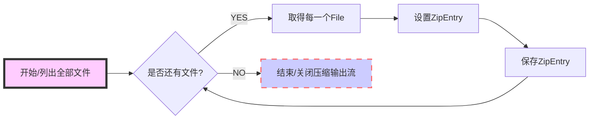

[toc]
# IO流面试
## 什么是比特(Bit),什么是字节(Byte),什么是字符(Char),它们长度是多少,各有什么区别?
- Bit最小的二进制单位 ，是计算机的操作部分 取值0或者1
- Byte是计算机操作数据的最小单位由8位bit组成 取值（-128-127）
- Char是用户的可读写的最小单位，在Java里面由16位bit组成 取值（0-65535）
- Bit 是最小单位 计算机 只能认识 0或者1
- 字节是给计算机看的
- 字符Char是看到的东西，一个字符=二个字节

## java中汉字究竟占几个字节？
- byte是1个字节，char是两个字节，但是char里可以存一个汉字，这么说汉字就占用两个字节？
- String类型里的汉字，按照编码格式的不同，分为2-4个字节的占用，
- UTF-8占用3个字节，特别的占用4个字节。
- GBK里汉字确实是占用2个字节。
- UTF-16里汉字一般占2个字节，特殊的是4个字节。
- 综上所述，那要看汉字是以什么编码格式来存储了，以及汉字是否为特殊汉字。

## Java中流的分类及介绍
### 分类：
- 按流的方向：输入流/输出流
- 按处理数据单位分：字节流/字符流
- 按实现功能分：节点流/处理流
### 介绍：
- 字节流：一次读入或读出是8位二进制
- 字符流：一次读入或读出是16位二进制
- 字节流和字符流的原理是相同的，只不过处理的单位不同而已。后缀是Stream是字节流，而后缀是Reader，Writer是字符流
- 字节流：处理字节数据的流对象。设备上的数据无论是图片或者dvd，文字，它们都以二进制存储的。二进制的最终都是以一个8位为数据单元进行体现，所以计算机中的最小数据单元就是字节。意味着，字节流可以处理设备上的所有数据，所以字节流一样可以处理字符数据
- 节点流：直接与数据源相连，读入或读出

==直接使用节点流，读写不方便，为了更快的读写文件，才有了处理流==
- 处理流：与节点流一块使用，在节点流的基础上，再套接一层，套接在节点流上的就是处理流

**下面是java IO流的结构示意图：**

==java io体系中子类的命名通常都是以父类的名称作为后缀==
### 字节流
#### InputStream：是表示字节输入流的所有类的超类【抽象类】
- FileInputStream：从文件系统中的某个文件中获得输入字节。哪些文件可用取决于主机环境。FileInputStream 用于读取诸如图像数据之类的原始字节流。要读取字符流，请考虑使用 FileReader。
- FilterInputStream：此类是过滤输入流的所有类的超类，包含其他一些输入流，它将这些流用作其基本数据源，它可以直接传输数据或提供一些额外的功能。
- BufferedInputStream：该类实现缓冲的输入字节流
#### OutputStream：此抽象类是表示输出字节流的所有类的超类【抽象类】
- FileOutputStream：文件输出流是用于将数据写入 File 或 FileDescriptor 的输出流
- FilterOutputStream：此类是过滤输出流的所有类的超类
- BufferedOutputStream：该类实现缓冲的输出流
### 字符流
#### Reader：用于读取字符流的抽象类【抽象类】
- BufferedReader：从字符输入流中读取文本，缓冲各个字符，从而实现字符、数组和行的高效读取。 可以指定缓冲区的大小，或者可使用默认的大小。大多数情况下，默认值就足够大了
- LineNumberReader：跟踪行号的缓冲字符输入流。此类定义了方法setLineNumber(int)和getLineNumbner()，它们可分别用于设置和获取当前行号
- InputStreamReader：是字节流通向字符流的桥梁：它使用指定的 charset 读取字节并将其解码为字符。它使用的字符集可以由名称指定或显式给定，或者可以接受平台默认的字符集
- FileReader：用来读取字符文件的便捷类。此类的构造方法假定默认字符编码和默认字节缓冲区大小都是适当的。要自己指定这些值，可以先在 FileInputStream 上构造一个 InputStreamReader
####  Writer：写入字符流【抽象类】
- BufferedWriter：将文本写入字符输出流，缓冲各个字符，从而提供单个字符、数组和字符串的高效写入
- OutputStreamWriter：是字符流通向字节流的桥梁：可使用指定的 charset 将要写入流中的字符编码成字节。它使用的字符集可以由名称指定或显式给定，否则将接受平台默认的字符集
- FileWriter：用来写入字符文件的便捷类。此类的构造方法假定默认字符编码和默认字节缓冲区大小都是可接受的。要自己指定这些值，可以先在 FileOutputStream 上构造一个 OutputStreamWriter

## 流的操作规律
### 1.明确源和目的
- 数据源：就是需要读取，可以使用两个体系：InputStream、Reader
- 数据汇：就是需要写入，可以使用两个体系：OutputStream、Writer
### 2.操作的数据是否是纯文本?
- 如果是：数据源：Reader； 数据汇：Writer
- 如果不是：数据源：InputStream； 数据汇：OutputStream
### 3.虽然确定了一个体系，但是该体系中有太多的对象，到底用哪个呢？
 ==明确操作的数据设备==
- 数据源对应的设备：硬盘(File)，内存(数组)，键盘(System.in)
- 数据汇对应的设备：硬盘(File)，内存(数组)，控制台(System.out)
### 4.需要在基本操作上附加其他功能吗？比如缓冲
== 如果需要就进行装饰==
```java
//记住，只要一读取键盘录入，就用这句话
BufferedReader bufr = new BufferedReader(new InputStreamReader(System.in));
BufferedWriter bufw = new BufferedWriter(new OutputStreamWriter(System.out));
// 采用设计模式中的装饰者模式
```

## BufferedReader属于哪种流,它主要是用来做什么的,它里面有那些经典的方法
属于处理流中的缓冲流，可以将读取的内容存在内存里面，有readLine()方法

## 什么是节点流,什么是处理流,它们各有什么用处,处理流的创建有什么特征?
- 节点流 直接与数据源相连，用于输入或者输出
- 处理流：在节点流的基础上对之进行加工，进行一些功能的扩展
处理流的构造器必须要 传入节点流的子类

## 如果我要对字节流进行大量的从硬盘读取,要用那个流,为什么?
BufferedInputStream 使用缓冲流能够减少对硬盘的损伤

## 如果我要打印出不同类型的数据到数据源,那么最适合的流是那个流,为什么?
Printwriter 可以打印各种数据类型

## 怎么样把我们控制台的输出改成输出到一个文件里面,这个技术叫什么?
SetOut（printWriter,printStream）重定向

## 怎么样把输出字节流转换成输出字符流,说出它的步骤?
使用 转换处理流OutputStreamWriter 可以将字节流转为字符流
new OutputStreamWriter(new FileOutputStream(File file));

## 把包括基本类型在内的数据和字符串按顺序输出到数据源，或者按照顺序从数据源读入，一般用哪两个流?
DataInputStream DataOutputStream

## 把一个对象写入数据源或者从一个数据源读出来,用哪两个流?
ObjectInputStream ObjectOutputStream

## 什么叫对象序列化，什么是反序列化，实现对象序列化需要做哪些工作?
对象序列化，将对象以二进制的形式保存在硬盘上
反序列化；将二进制的文件转化为对象读取
实现serializable接口
==不想让字段放在硬盘上就加transient关键字==

## 序列化可以做什么?
对象序列化可以用来传输消息,并且以流的形式传输,提高传输效率,使用场景如远程服务调用rpc

## 在实现序列化接口是时候一般要生成一个serialVersionUID字段,它叫做什么,一般有什么用？
- 是版本号，要保持版本号的一致 来进行序列化
- 为了防止序列化出错

## InputStream里的read()返回的是什么,read(byte[] data)是什么意思,返回的是什么值
返回的是所读取的字节的int型（范围0-255）
read(byte[] data) 将读取的字节储存在这个数组
返回的就是传入数组参数个数
Read  字节读取字节  字符读取字符

## OutputStream里面的write()是什么意思,write(byte b[], int off, int len)这个方法里面的三个参数分别是什么意思?
- write将指定字节传入数据源
- Byte b[]是byte数组
- b[off]是传入的第一个字符
- b[off+len-1]是传入的最后的一个字符
- len是实际长度

## 流一般需要不需要关闭,如果关闭的话用什么方法,一般要在那个代码块里面关闭比较好，处理流是怎么关闭的，如果有多个流互相调用传入是怎么关闭的？
- 流一旦打开就必须关闭，使用close方法
- 放入finally语句块中（finally 语句一定会执行）
- 调用的处理流就关闭处理流
- 多个流互相调用只关闭最外层的流

## Java中的所有的流可以分为几大类,它们的名字是什么,各代表什么?
1. 字节输入流 InputStream
2. 字节输出流 OutputStream
3. 字符输入流 Reader
4. 字符输出流 Writer
5. 所有流都是这四个流的子类

## 说下常用的io流
- InputStream,OutputStream
- FileInputStream,FileOutputStream
- BufferedInputStream,BufferedOutputStream
- Reader,Writer
- BufferedReader,BufferedWriter

## io流怎样读取文件的？
使用File对象获取文件路径，通过字符流Reader加入文件，使用字符缓存流BufferedReader处理Reader，再定义一个字符串，循环遍历出文件。代码如下：
```java
public static void main(String[] args) {
    File file = new File("d:/spring.txt");
    try {
        Reader reader = new FileReader(file);
        BufferedReader buffered = new BufferedReader(reader);
        String data = null;
        while ((data = buffered.readLine()) != null) {
            System.out.println(data);
        }
    } catch (FileNotFoundException e) {
        e.printStackTrace();
    } catch (IOException e) {
        e.printStackTrace();
    }
}
```
## 说说你对io流的理解
o流主要是用来处理输入输出问题，常用的io流有InputStream，OutputStream，Reader，Writer等

## JAVA的IO流和readLine方法
Java的io流用来处理输入输出问题，readLine是BufferedReader里的一个方法，用来读取一行。

## 用什么把对象动态的写入磁盘中，写入要实现什么接口。
ObjectInputStream，需要实现Serializable接口

## FileInputStream 创建详情，怎样创建不报错，列了几种形式
FileInputStream是InputStream的子类，通过接口定义，子类实现创建FileInputStream,

## 请问你在什么情况下会在你得java代码中使用可序列化？ 如何实现java序列化？
把一个对象写入数据源或者从一个数据源读出来，使用可序列化，需要实现Serializable接口

## PrintStream、BufferedWriter、PrintWriter的比较?
- PrintStream类的输出功能非常强大，通常如果需要输出文本内容，都应该将输出流包装成PrintStream后进行输出。它还提供其他两项功能。与其他输出流不同，PrintStream 永远不会抛出 IOException；而是，异常情况仅设置可通过 checkError 方法测试的内部标志。另外，为了自动刷新，可以创建一个 PrintStream
- BufferedWriter：将文本写入字符输出流，缓冲各个字符从而提供单个字符，数组和字符串的高效写入。通过write()方法可以将获取到的字符输出，然后通过newLine()进行换行操作。BufferedWriter中的字符流必须通过调用flush方法才能将其刷出去。并且BufferedWriter只能对字符流进行操作。如果要对字节流操作，则使用BufferedInputStream。
- PrintWriter的println方法自动添加换行，不会抛异常，若关心异常，需要调用checkError方法看是否有异常发生，PrintWriter构造方法可指定参数，实现自动刷新缓存（autoflush）；

## 读写原始数据，一般采用什么流？(A C)
A. InputStream
B. DataInputStream
C. OutputStream
D. BufferedInputStream

## 为了提高读写性能，可以采用什么流？(D F)
A. InputStream
B. DataInputStream
C. BufferedReader
D. BufferedInputStream
E. OutputStream
F. BufferedOutputStream

## 对各种基本数据类型和String类型的读写，采用什么流？(A D)
A. DataInputStream
B. BufferedReader
C. PrintWriter
D. DataOutputStream
E. ObjectInputStream
F. ObjectOutputStream

## 能指定字符编码的I/O流类型是：(B H)
A. Reader
B. InputStreamReader
C. BufferedReader
D. Writer
E. PrintWriter
F. ObjectInputStream
G. ObjectOutputStream
H. OutputStreamWriter

## File类型中定义了什么方法来判断一个文件是否存在？(D)
A. createNewFile
B. renameTo
C. delete
D. exists

## File类型中定义了什么方法来创建一级目录？(C D)
A. createNewFile
B. exists
C. mkdirs
D. mkdir
> File类的mkdir方法根据抽象路径创建目录；File类的mkdirs方法根据抽象路径创建目录，==包括创建必需但不存在的父目录==

## 在unix服务器www.openlab.com.cn上提供了基于TCP的时间服务应用，该应用使用port为13。创建连接到此服务器的语句是：(A)
A. Socket s = new Socket(“www.openlab.com.cn”, 13);
B. Socket s = new Socket(“www.openlab.com.cn:13”);
C. Socket s = accept(“www.openlab.com.cn”, 13);

## Java UDP编程主要用到的两个类型是：(B D)
A. UDPSocket
B. DatagramSocket
C. UDPPacket
D. DatagramPacket

## TCP/IP是一种：(B)
A. 标准
B. 协议  
C. 语言  
D. 算法
***

## 创建一个TCP客户程序的顺序是：
1. 创建socket
2. 获取I/O流
3. 对I/O流进行读写操作
4. 关闭I/O流
5. 关闭socket

##  创建一个TCP服务程序的顺序是:
1. 创建一个服务器socket
2. 从服务器socket接受客户连接请求
3. 创建一个服务线程处理新的连接
4. 在服务线程中，从socket中获得I/O流
5. 对I/O流进行读写操作，完成与客户的交互
6. 关闭I/O流
7. 关闭socket

***
## PrintStream使用

- PrintStream(OutputStream)，将数据写入到输出字节流
- PrintStream(OutputStream,boolean)，将数据写入到输出流，true自动刷新
- PrintStream(OutputStream,boolean,String),将数据写入到输出流，true自动刷新,设置编码方式
- PrintStream(String),PrintStream(File)，将数据直接写入到文件
- PrintStream(String,String),PrintStream(File,String)，将数据直接写入到文件，设置编码方式

***
## PrintWriter使用

**从构造方法可以看出：**
- PrintStream可以将数据==写入到输出字节流==
- PrintStream可以将数据==写入到输出字符流==
- PrintStream可以将数据==直接写入到文件中==

## IO流,zip文件操作
### 简介
- 压缩流操作主要的三个类 ZipOutputStream、ZipFile、ZipInputStream
- 经常可以看到各种压缩文件：zip、jar、GZ格式的压缩文件
### ZipEntry
- 在每一个压缩文件中都会存在多个子文件，那么这每一个子文件在Java中使用ZipEntry表示
- ZipEntry类的常用方法

| ---                          | ---  | ---                                |
| :----------------------------: | :----: | :----------------------------------: |
| 方法                         | 类型 | 描述                               |
| public ZipEntry(String name) | 构造 | 创建对象并指定要创建的ZipEntry名称 |
| public boolean isDirectory   | 普通 | 判断此ZipEntry是否是目录           |

== 说明：在实例化ZipEntry 的时候，要设置名称，此名称实际上就是压缩文件中每一个元素的名称==
### ZipOutputStream
- 如果要想完成一个文件或文件夹的压缩，要使用ZipOutputStream类完成
- ZipOutputStream是OutputStream的子类

|                           ---                           | ---  |          ---           |
|:-------------------------------------------------------:|:----:|:----------------------:|
|                          方法                           | 类型 |          描述          |
|        public ZipOutputStream(OutputStream out)         | 构造 |   创建新的zip输出流    |
| public void putNextEntry(ZipEntry e) throws IOException | 普通 | 设置每一个ZipEntry对象 |
|         public void setComment(String comment)          | 普通 |   设置zip文件的注释    |

### 压缩一个文件
```java
import java.io.File;
import java.io.FileInputStream;
import java.io.InputStream;
import java.util.zip.ZipEntry;
import java.util.zip.ZipOutputStream;
import java.io.FileOutputStream;

public class ZipOutputStreamDemo01 {
    public static void main(String args[]) throws Exception {    // 所有异常抛出
        File file = new File("d:" + File.separator + "mldn.txt");  // 定义要压缩的文件
        File zipFile = new File("d:" + File.separator + "mldn.zip");   // 定义压缩文件名称
        InputStream input = new FileInputStream(file); // 定义文件的输入流
        ZipOutputStream zipOut = null; // 声明压缩流对象
        zipOut = new ZipOutputStream(new FileOutputStream(zipFile));
        zipOut.putNextEntry(new ZipEntry(file.getName())); // 设置ZipEntry对象
        zipOut.setComment("www.mldnjava.cn");  // 设置注释
        int temp = 0;
        while ((temp = input.read()) != -1) { // 读取内容
            zipOut.write(temp);    // 压缩输出
        }
        input.close(); // 关闭输入流
        zipOut.close();    // 关闭输出流
    }
}
```
### 压缩一个文件夹
上面是对一个文件进行压缩，但是在日常的开发中，王五需要对一个问价夹进行压缩，例如：现在在d盘中存在一个test的文件夹。
==压缩流程图：==

```java
import java.io.File;
import java.io.FileInputStream;
import java.io.InputStream;
import java.util.zip.ZipEntry;
import java.util.zip.ZipOutputStream;
import java.io.FileOutputStream;

public class ZipOutputStreamDemo01 {
    public static void main(String args[]) throws Exception {    // 所有异常抛出
        File file = new File("d:" + File.separator + "test");  // 定义要压缩的文件夹
        File zipFile = new File("d:" + File.separator + "test.zip");    // 定义压缩文件名称
        InputStream input = null;  // 定义文件输入流
        ZipOutputStream zipOut = null; // 声明压缩流对象
        zipOut = new ZipOutputStream(new FileOutputStream(zipFile));
        zipOut.setComment("www.mldnjava.cn");  // 设置注释
        int temp = 0;
        if (file.isDirectory()) { // 判断是否是文件夹
            File lists[] = file.listFiles();   // 列出全部文件
            for (int i = 0; i < lists.length; i++) {
                input = new FileInputStream(lists[i]); // 定义文件的输入流
                zipOut.putNextEntry(new ZipEntry(file.getName()
                        + File.separator + lists[i].getName()));  // 设置ZipEntry对象
                while ((temp = input.read()) != -1) { // 读取内容
                    zipOut.write(temp);    // 压缩输出
                }
                input.close(); // 关闭输入流
            }
        }
        zipOut.close();    // 关闭输出流
    }
}
```
### zipFile
- 在Java中，每一个压缩文件都可以使用ZipFile表示，还可以使用ZipFile根据压缩后的文件名称找到每一个压缩文件中的ZipEntry并将其进行压缩操作。

| ---                                                                  | ---  | ---                             |
| -------------------------------------------------------------------- | ---- | ------------------------------- |
| 方法                                                                 | 类型 | 描述                            |
| public ZipFile(File file) throws ZipException,IOException            | 构造 | 根据File类实例化ZipFile对象     |
| public ZipEntry getEntry(String name)                                | 普通 | 根据名称找到其对应的ZipEntry    |
| public InputStream getInputStream(ZipEntry entry) throws IOException | 普通 | 根据ZipEntry取得InputStream实例 |
| public String getName()                                              | 普通 | 取得压缩文件的路径名称          |

- 第一步：为ZipFile实例化，实例化时需要接受File类的引用
```java
import java.io.File;
import java.util.zip.ZipFile;

public class ZipFileDemo01 {
    public static void main(String args[]) throws Exception {    // 所有异常抛出
        File file = new File("d:" + File.separator + "test.zip");  // 找到压缩文件
        ZipFile zipFile = new ZipFile(file);   // 实例化ZipFile对象
        System.out.println("压缩文件的名称：" + zipFile.getName());    // 得到压缩文件的名称
    }
}
```
- 通过ZipFile 文件，为test.zip 进行解压缩操作
```java
import java.io.File;
import java.io.FileInputStream;
import java.io.InputStream;
import java.util.zip.ZipEntry;
import java.util.zip.ZipOutputStream;
import java.io.FileOutputStream;

public class ZipOutputStreamDemo01 {
    public static void main(String args[]) throws Exception {    // 所有异常抛出
        File file = new File("d:" + File.separator + "test");  // 定义要压缩的文件夹
        File zipFile = new File("d:" + File.separator + "test.zip");    // 定义压缩文件名称
        InputStream input = null;  // 定义文件输入流
        ZipOutputStream zipOut = null; // 声明压缩流对象
        zipOut = new ZipOutputStream(new FileOutputStream(zipFile));
        zipOut.setComment("www.mldnjava.cn");  // 设置注释
        int temp = 0;
        if (file.isDirectory()) { // 判断是否是文件夹
            File lists[] = file.listFiles();   // 列出全部文件
            for (int i = 0; i < lists.length; i++) {
                input = new FileInputStream(lists[i]); // 定义文件的输入流
                zipOut.putNextEntry(new ZipEntry(file.getName()
                        + File.separator + lists[i].getName()));  // 设置ZipEntry对象
                while ((temp = input.read()) != -1) { // 读取内容
                    zipOut.write(temp);    // 压缩输出
                }
                input.close(); // 关闭输入流
            }
        }
        zipOut.close();    // 关闭输出流
    }
}
```
