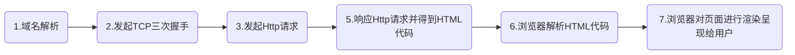

[toc]
# 网络编程面试题
## 什么是网络编程
- 《网络编程》通过使用套接字来达到进程间通信目的的编程就是网络编程。windows提供的基于网络编程的就是套接字也就是winsock，同时Winpcap也是一个比较方便的工具。
- 网络编程从大的方面说就是对信息的发送到接收，中间传输为物理线路的作用，编程人员可以不用考虑……
网络编程最主要的工作就是在发送端把信息通过规定好的协议进行组装包，在接收端按照规定好的协议把包进行解析，从而提取出对应的信息，达到通信的目的!中间最主要的就是数据包的组装，数据包的过滤，数据包的捕获，数据包的分析，当然最后再做一些处理!
- 代码,开发工具,数据库,服务器架设和网页设计这5部分你都要接触
## HTTP必知必会
对器客户端和服务器端之间数据传输的格式规范，格式简称为“超文本传输协议”
### Http协议有哪些特征?
支持客户/服务器模式；2、简单快速；3、灵活；4、无连接；5、无状态
### HTTP流程

### 常用的HTTP方法有哪些？
- GET：用于请求访问已经被URI（统一资源标识符）识别的资源，可以通过URL传参给服务器
- POST：用于传输信息给服务器，主要功能与GET方法类似，但一般推荐使用POST方式。
- PUT：传输文件，报文主体中包含文件内容，保存到对应URI位置。
- HEAD：获得报文首部，与GET方法类似，只是不返回报文主体，一般用于验证URI是否有效。
- DELETE：删除文件，与PUT方法相反，删除对应URI位置的文件。
- OPTIONS：查询相应URI支持的HTTP方法！
### HTTP中GET与POST的区别
- GET/POST都是TCP链接
- GET在浏览器回退时是无害的，而POST会再次提交请求。
- GET产生的URL地址可以被Bookmark，而POST不可以。
- GET请求会被浏览器主动cache，而POST不会，除非手动设置。
- GET请求只能进行url编码，而POST支持多种编码方式。
- GET请求参数会被完整保留在浏览器历史记录里，而POST中的参数不会被保留。
- GET请求在URL中传送的参数是有长度限制的，而POST么有。
- 对参数的数据类型，GET只接受ASCII字符，而POST没有限制。
- GET比POST更不安全，因为参数直接暴露在URL上，所以不能用来传递敏感信息。
- GET参数通过URL传递，POST放在Request body中。
- GET编码类型application/x-www-form-url，POST编码类型encodedapplication/x-www-
### HTTP请求报文与响应报文格式
==请求报文包含三部分：==
1. 请求行：包含请求方法、URI、HTTP版本信息
2. 请求首部字段
3. 请求内容实体
==响应报文包含三部分：==
1. 状态行：包含HTTP版本、状态码、状态码的原因短语
2. 响应首部字段
3. 响应内容实体
### 常用HTTP相应状态码
- 200：请求被正常处理
- 204：请求被受理但没有资源可以返回
- 206：客户端只是请求资源的一部分，服务器只对请求的部分资源执行GET方法，相应报文中通过Content-Range指定范围的资源。
- 301：永久性重定向
- 302：临时重定向
- 303：与302状态码有相似功能，只是它希望客户端在请求一个URI的时候，能通过GET方法重定向到另一个URI上
- 304：发送附带条件的请求时，条件不满足时返回，与重定向无关
- 307：临时重定向，与302类似，只是强制要求使用POST方法
- 400：请求报文语法有误，服务器无法识别
- 401：请求需要认证
- 403：请求的对应资源禁止被访问
- 404：服务器无法找到对应资源
- 500：服务器内部错误
- 503：服务器正忙
### HTTP1.1版本新特性
1. 默认持久连接节省通信量，只要客户端服务端任意一端没有明确提出断开TCP连接，就一直保持连接，可以发送多次HTTP请求
2. 管线化，客户端可以同时发出多个HTTP请求，而不用一个个等待响应
3. 断点续传原理
### 常见HTTP首部字段
1. 通用首部字段（请求报文与响应报文都会使用的首部字段）
- Date：创建报文时间
- Connection：连接的管理
- Cache-Control：缓存的控制
- Transfer-Encoding：报文主体的传输编码方式
2. 请求首部字段（请求报文会使用的首部字段）
- Host：请求资源所在服务器
- Accept：可处理的媒体类型
- Accept-Charset：可接收的字符集
- Accept-Encoding：可接受的内容编码
- Accept-Language：可接受的自然语言
3. 响应首部字段（响应报文会使用的首部字段）
- Accept-Ranges：可接受的字节范围
- Location：令客户端重新定向到的URI
- Server：HTTP服务器的安装信息
4. 实体首部字段（请求报文与响应报文的的实体部分使用的首部字段）
- Allow：资源可支持的HTTP方法
- Content-Type：实体主类的类型
- Content-Encoding：实体主体适用的编码方式
- Content-Language：实体主体的自然语言
- Content-Length：实体主体的的字节数
- Content-Range：实体主体的位置范围，一般用于发出部分请求时使用
### HTTP的缺点与HTTPS
1. 通信使用明文不加密，内容可能被窃听
2. 不验证通信方身份，可能遭到伪装
3. 无法验证报文完整性，可能被篡改
HTTPS就是HTTP加上加密处理（一般是SSL安全通信线路）+认证+完整性保护
### HTTP优化
1. 利用负载均衡优化和加速HTTP应用
2. 利用HTTP Cache来优化网站

## tcp和udp的区别
- TCP和UDP都是IP层的传输协议，是IP与上层之间的处理接口
- TCP(传输控制协议)：是面向连接(三次握手机制)的流传输控制协议，具有高可靠性，确保传输数据的正确性，有验证重发机制，因此不会出现丢失或乱序
- UDP(用户数据报协议)：是无连接的数据报服务，不对数据报进行检查与修改，无须等待对方的应答，会出现分组丢失、重复、乱序，但具有较好的实时性，UDP段结构比TCP的段结构简单，因此网络开销也小
- TCP面向字节流的传输，UDP面向数据报的传输

## tcp连接建立的时候3次握手，断开连接的4次握手的具体过程
### 3次握手
1. 第一次握手是客户端connect连接到server
2. 第二次server accept client的请求之后，向client端发送一个消息，相当于说我都准备好了，你连接上我了
3. 第三次 就是client向server发送的，就是对第二次握手消息的确认。之后client和server就开始通讯了
### 四次握手
1. 断开连接的一端发送close请求是第一次握手
2. 另外一端接收到断开连接的请求之后需要对close进行确认，发送一个消息，这是第二次握手
3. 发送了确认消息之后还要向对端发送close消息，要关闭对对端的连接，这是第3次握手
4. 而在最初发送断开连接的一端接收到消息之后，进入到一个很重要的状态time_wait状态，这个状态也是面试官经常问道的问题，最后一次握手是最初发送断开连接的一端接收到消息之后。对消息的确认

## IP地址
互联网协议地址（英语：Internet Protocol Address，又译为网际协议地址），缩写为IP地址（IP Address）。IP地址是IP协议提供的一种统一的地址格式，它为互联网上的每一个网络和每一台主机分配一个逻辑地址，以此来屏蔽物理地址的差异
- IP地址工作在OSI参考模型的第三层网络层
- IP地址编址方案将IP地址空间划分为A、B、C、D、E五类，其中A、B、C是基本类，D、E类作为多播和保留使用
- IPV4就是有4段数字，每一段最大不超过255
- IPv6采用128位地址长度
### 构成
- IP地址可以视为网络标识号码与主机标识号码两部分，因此IP地址可分两部分组成，一部分为网络地址，另一部分为主机地址
> 网络号的位数直接决定了可以分配的网络数（计算方法2^网络号位数-2）,主机号的位数则决定了网络中最大的主机数（计算方法2^主机号位数-2）
- IP地址分为A、B、C、D、E 五类，它们适用的类型分别为：大型网络；中型网络；小型网络；多目地址；备用。常用的是B和C两类
### 分配
- TCP/IP协议需要针对不同的网络进行不同的设置，且每个节点一般需要一个“IP地址”、一个“子网掩码”、一个“默认网关”。不过，可以通过动态主机配置协议（DHCP），给客户端自动分配一个IP地址，避免了出错，也简化了TCP/IP协议的设置
### 共有地址
公有地址（Public address）由Inter NIC（Internet Network Information Center因特网信息中心）负责。这些IP地址分配给注册并向Inter NIC提出申请的组织机构。通过它直接访问因特网。
### 私有地址
私有地址（Private address）属于非注册地址，专门为组织机构内部使用。
以下列出留用的内部私有地址
- A类 10.0.0.0--10.255.255.255
- B类 172.16.0.0--172.31.255.255
- C类 192.168.0.0--192.168.255.255

|   ---    |      ---      |            ---             |        ---        |             ---              |
|:--------:|:-------------:|:--------------------------:|:-----------------:|:----------------------------:|
| 网络类别 |  最大网络数   |         IP地址范围         |    最大主机数     |        私有IP地址范围        |
|    A     |  126（2^7-2)  |  1.0.0.0--127.255.255.255  | 16777214 [2^24-2] |   10.0.0.0--10.255.255.255   |
|    B     |  16384(2^14)  | 128.0.0.0--191.255.255.255 |  65534 [2^16-2]   |  172.16.0.0--172.31.255.255  |
|    C     | 2097152(2^21) | 192.0.0.0--223.255.255.255 |    254 [2^8-2]    | 192.168.0.0--192.168.255.255 |
## MAC地址
MAC(Media Access Control或者Medium Access Control)地址，意译为媒体访问控制，或称为物理地址、硬件地址，用来定义网络设备的位置。在OSI模型中，第三层网络层负责 IP地址，第二层数据链路层则负责 MAC地址。因此一个主机会有一个MAC地址，而每个网络位置会有一个专属于它的IP地址。MAC地址是网卡决定的，是固定的。
- MAC地址，也叫硬件地址，长度是48比特(6字节)，由16进制的数字组成，分为前24位和后24位
- MAC地址对应于OSI参考模型的第二层数据链路层，工作在数据链路层的交换机维护着计算机MAC地址和自身端口的数据库，交换机根据收到的数据帧中的"目的MAC地址"字段来转发数据帧
- 网卡的物理地址通常是由网卡生产厂家烧入网卡的EPROM(一种闪存芯片，通常可以通过程序擦写)，它存储的是传输数据时真正赖以标识发出数据的电脑和接收数据的主机的地址
## MAC地址与IP地址区别
1. 对于网络上的某一设备，如一台计算机或一台路由器，其IP地址是基于网络拓扑设计出的，同一台设备或计算机上，改动IP地址是很容易的（但必须唯一），而MAC则是生产厂商烧录好的，一般不能改动。我们可以根据需要给一台主机指定任意的IP地址，如我们可以给局域网上的某台计算机分配IP地址为192.168.0.112 ，也可以将它改成192.168.0.200。而任一网络设备（如网卡，路由器）一旦生产出来以后，其MAC地址不可由本地连接内的配置进行修改。如果一个计算机的网卡坏了，在更换网卡之后，该计算机的MAC地址就变了
2. 长度不同。IP地址为32位，MAC地址为48位
3. 分配依据不同。IP地址的分配是基于网络拓扑，MAC地址的分配是基于制造商
4. 寻址协议层不同。IP地址应用于OSI第三层，即网络层，而MAC地址应用在OSI第二层，即数据链路层。 数据链路层协议可以使数据从一个节点传递到相同链路的另一个节点上（通过MAC地址），而网络层协议使数据可以从一个网络传递到另一个网络上（ARP根据目的IP地址，找到中间节点的MAC地址，通过中间节点传送，从而最终到达目的网络）

## 什么是同步？什么是异步？
### 同步：
如果有多个任务或者事件要发生，这些任务或者事件必须逐个地进行，一个事件或者任务的执行会导致整个流程的暂时等待，这些事件没有办法并发地执行；单线程
### 异步：
如果有多个任务或者事件发生，这些事件可以并发地执行，一个事件或者任务的执行不会导致整个流程的暂时等待；通过多线程实现

## 流量控制和拥塞控制
### 拥塞控制
网络拥塞现象是指到达通信子网中某一部分的分组数量过多,使得该部分网络来不及处理,以致引起这部分乃至整个网络性能下降的现象,严重时甚至会导致网络通信业务陷入停顿,即出现死锁现象。拥塞控制是处理网络拥塞现象的一种机制
### 流量控制
数据的传送与接收过程当中很可能出现收方来不及接收的情况,这时就需要对发方进行控制,以免数据丢失

## 多线程如何同步
### Windows
线程同步有四种方式：临界区、内核对象、互斥量、信号量
### Linux
线程同步有最常用的是：互斥锁、条件变量和信号量

## 进程间通讯的方式有哪些，各有什么优缺点
早期UNIX进程间通信、基于System V进程间通信、基于Socket进程间通信和POSIX进程间通信。
UNIX进程间通信方式包括：管道、FIFO、信号。
System V进程间通信方式包括：System V消息队列、System V信号灯、System V共享内存、
POSIX进程间通信包括：posix消息队列、posix信号灯、posix共享内存。
现在linux使用的进程间通信方式：
1. 管道（pipe）和有名管道（FIFO）
2. 信号（signal）
3. 消息队列
4. 共享内存
5. 信号量
5. 套接字（socket)

## epoll与select的区别
- select在一个进程中打开的最大fd是有限制的，由FD_SETSIZE设置，默认值是2048。不过 epoll则没有这个限制，它所支持的fd上限是最大可以打开文件的数目，这个数字一般远大于2048，一般来说内存越大，fd上限越大，1G内存都能达到大约10w左右。
- select的轮询机制是系统会去查找每个fd是否数据已准备好，当fd很多的时候，效率当然就直线下降了，epoll采用基于事件的通知方式，一旦某个fd数据就绪时，内核会采用类似callback的回调机制，迅速激活这个文件描述符，而不需要不断的去轮询查找就绪的描述符，这就是epoll高效最本质的原因。
- 无论是select还是epoll都需要内核把FD消息通知给用户空间，如何避免不必要的内存拷贝就很重要，在这点上，epoll是通过内核于用户空间mmap同一块内存实现的，而select则做了不必要的拷贝

## epoll中et和lt的区别与实现原理
- LT：水平触发，效率会低于ET触发，尤其在大并发，大流量的情况下。但是LT对代码编写要求比较低，不容易出现问题。LT模式服务编写上的表现是：只要有数据没有被获取，内核就不断通知你，因此不用担心事件丢失的情况。
- ET：边缘触发，效率非常高，在并发，大流量的情况下，会比LT少很多epoll的系统调用，因此效率高。但是对编程要求高，需要细致的处理每个请求，否则容易发生丢失事件的情况

## connect方法会阻塞，请问有什么方法可以避免其长时间阻塞？
最通常的方法最有效的是加定时器；也可以采用非阻塞模式

## 网络中，如果客户端突然掉线或者重启，服务器端怎么样才能立刻知道？
若客户端掉线或者重新启动，服务器端会收到复位信号，每一种tcp/ip得实现不一样，控制机制也不一样

## 在子网210.27.48.21/30种有多少个可用地址？分别是什么？
30表示的是网络号(network number)是30位，剩下2位中11是广播(broadcast)地址，00是multicast地址，只有01和10可以作为host address
> 210.27.48.21/30代表的子网的网络号是30位，即网络号是210.27.48.21 & 255.255.255.251=210.27.48.20，此子网的地址空间是2位，即可以有4个地址：210.27.48.20, 210.27.48.21, 210.27.48.22, 210.27.48.23。第一个地址的主机号(host number/id)是0，而主机号0代表的是multicast地址。最后一个地址的最后两位是11，主机号每一位都为1代表的是广播(broadcast)地址。所以只有中间两个地址可以给host使用。其实那个问题本身不准确，广播或multicast地止也是可以使用的地址，所以回答4也应该正确，当然问的人也可能是想要你回答2。我个人觉得最好的回答是一个广播地址，一个multicast地址，2个unicast地址

## 路由表示做什么用的？在linux环境中怎么来配置一条默认路由？
路由表是用来决定如何将包从一个子网传送到另一个子网的，换局话说就是用来决定从一个网卡接收到的包应该送的哪一张网卡上的。在Linux上可以用“route add default gw <默认路由器IP>”来配置一条默认路由
> 路由表是用来决定如何将包从一个子网传送到另一个子网的，换局话说就是用来决定从一个网卡接收到的包应该送的哪一张网卡上的。路由表的每一行至少有目标网络号、netmask、到这个子网应该使用的网卡。当路由器从一个网卡接收到一个包时，它扫描路由表的每一行，用里面的netmask和包里的目标IP地址做并逻辑运算(&)找出目标网络号，如果此网络号和这一行里的网络号相同就将这条路由保留下来做为备用路由，如果已经有备用路由了就在这两条路由里将网络号最长的留下来，另一条丢掉，如此接着扫描下一行直到结束。如果扫描结束任没有找到任何路由，就用默认路由。确定路由后，直接将包送到对应的网卡上去。在具体的实现中，路由表可能包含更多的信息为选路由算法的细节所用。题外话：路由算法其实效率很差，而且不scalable，解决办法是使用IP交换机，比如MPLS。
在Linux上可以用“route add default gw <默认路由器IP>”来配置一条默认路由

## 在网络中有两台主机A和B，并通过路由器和其他交换设备连接起来，已经确认物理连接正确无误，怎么来测试这两台机器是否连通？如果不通，怎么来判断故障点？怎么排除故障？
测试这两台机器是否连通：从一台机器ping另一台机器，如果ping不通，用traceroute可以确定是哪个路由器不能连通，然后再找问题是在交换设备/hup/cable等

## 网络编程中设计并发服务器，使用多进程 与 多线程 ，请问有什么区别？
==答案一：==
1. 进程：子进程是父进程的复制品。子进程获得父进程数据空间、堆和栈的复制品。
2. 线程：相对与进程而言，线程是一个更加接近与执行体的概念，它可以与同进程的其他线程共享数据，但拥有自己的栈空间，拥有独立的执行序列。
两者都可以提高程序的并发度，提高程序运行效率和响应时间。
线程和进程在使用上各有优缺点：线程执行开销小，但不利于资源管理和保护；而进程正相反。同时，线程适合于在SMP机器上运行，而进程则可以跨机器迁移。

==答案二：==
根本区别就一点：用多进程每个进程有自己的地址空间(address space)，线程则共享地址空间。所有其它区别都是由此而来的：
1. 速度：线程产生的速度快，线程间的通讯快、切换快等，因为他们在同一个地址空间内。
2. 资源利用率：线程的资源利用率比较好也是因为他们在同一个地址空间内。
3. 同步问题：线程使用公共变量/内存时需要使用同步机制还是因为他们在同一个地址空间内

## 网络编程的一般步骤
### 对于TCP连接
1. 服务器端1）创建套接字create；2）绑定端口号bind；3）监听连接listen；4）接受连接请求accept，并返回新的套接字；5）用新返回的套接字recv/send；6）关闭套接字
2. 客户端1）创建套接字create; 2）发起建立连接请求connect; 3）发送/接收数据send/recv；4）关闭套接字
==TCP总结：==
Server端：create–bind–listen–accept–recv/send–close
Client端：create—conncet—send/recv—close
### 对于UDP连接：
1. 服务器端:1）创建套接字create；2）绑定端口号bind；3）接收/发送消息recvfrom/sendto；4）关闭套接字
2. .客户端:1）创建套接字create；2）发送/接收消息sendto/recvfrom；3）关闭套接字
==UDP总结：==
Server端：create—bind—recvfrom/sendto—close
Client端：create—sendto/recvfrom—close
### TCP的重发机制是怎么实现的？
1. 滑动窗口机制，确立收发的边界，能让发送方知道已经发送了多少（已确认）、尚未确认的字节数、尚待发送的字节数；让接收方知道（已经确认收到的字节数）
2. 选择重传，用于对传输出错的序列进行重传

## TTL是什么？有什么用处，通常那些工具会用到它？（ping? traceroute? ifconfig? netstat?）

## 网络编程时的同步、异步、阻塞、非阻塞？
- 同步：函数调用在没得到结果之前，没有调用结果，不返回任何结果
- 异步：函数调用在没得到结果之前，没有调用结果，返回状态信息
- 阻塞：函数调用在没得到结果之前，当前线程挂起。得到结果后才返回
- 非阻塞：函数调用在没得到结果之前，当前线程不会挂起，立即返回结果

## Java如何实现无阻塞方式的Socket编程？
- NIO有效解决了多线程服务器存在的线程开销问题。在NIO中使用多线程主要目的不是为了应对每个客户端请求而分配独立的服务线程，而是通过多线程充分利用多个CPU的处理能力和处理中的等待时间，达到提高服务能力的目的
> NIO(New Input/Output)类, 基于通道和缓冲区的I/O方式

## 深入理解Java NIO
TTL是Time To Live，一般是hup count，每经过一个路由就会被减去一，如果它变成0，包会被丢掉。它的主要目的是防止包在有回路的网络上死转，浪费网络资源。ping和traceroute用到它
> TTL是Time To Live，目前是hup count，当包每经过一个路由器它就会被减去一，如果它变成0，路由器就会把包丢掉。IP网络往往带有环(loop)，比如子网A和子网B有两个路由器相连，它就是一个loop。TTL的主要目的是防止包在有回路的网络上死转，因为包的TTL最终后变成0而使得此包从网上消失(此时往往路由器会送一个ICMP包回来，traceroute就是根据这个做的)。ping会送包出去，所以里面有它，但是ping不一定非要不可它。traceroute则是完全因为有它才能成的。ifconfig是用来配置网卡的，netstat -rn 是用来列路由表的，所以都用不着它

### 初始NIO
在JDK 1.4中新加入了NIO( New Input/ Output)类, 引入了一种基于通道和缓冲区的 I/O 方式，它可以使用Native函数库直接分配堆外内存，然后通过一个存储在Java堆的 DirectByteBuffer对象作为这块内存的引用进行操作，避免了在 Java 堆和 Native 堆中来回复制数据。
NIO 是一种同步非阻塞的 IO 模型。同步是指线程不断轮询 IO 事件是否就绪，非阻塞是指线程在等待 IO 的时候，可以同时做其他任务。同步的核心就是 Selector，Selector 代替了线程本身轮询 IO 事件避免了阻塞同时减少了不必要的线程消耗；非阻塞的核心就是通道和缓冲区，当 IO 事件就绪时，可以通过写道缓冲区，保证 IO 的成功，而无需线程阻塞式地等待
### Buffer：
为什么说NIO是基于缓冲区的IO方式呢？因为，当一个链接建立完成后，IO的数据未必会马上到达，为了当数据到达时能够正确完成IO操作，在BIO（阻塞IO）中，等待IO的线程必须被阻塞，以全天候地执行IO操作。为了解决这种IO方式低效的问题，引入了缓冲区的概念，当数据到达时，可以预先被写入缓冲区，再由缓冲区交给线程，因此线程无需阻塞地等待IO。
### 通道：
当执行：SocketChannel.write(Buffer)，便将一个 buffer 写到了一个通道中。如果说缓冲区还好理解，通道相对来说就更加抽象。网上博客难免有写不严谨的地方，容易使初学者感到难以理解。
引用 Java NIO 中权威的说法：通道是 I/O 传输发生时通过的入口，而缓冲区是这些数 据传输的来源或目标。对于离开缓冲区的传输，您想传递出去的数据被置于一个缓冲区，被传送到通道。对于传回缓冲区的传输，一个通道将数据放置在您所提供的缓冲区中。
例如 有一个服务器通道 ServerSocketChannel serverChannel，一个客户端通道 SocketChannel clientChannel；服务器缓冲区：serverBuffer，客户端缓冲区：clientBuffer。
当服务器想向客户端发送数据时，需要调用：clientChannel.write(serverBuffer)。当客户端要读时，调用 clientChannel.read(clientBuffer)
当客户端想向服务器发送数据时，需要调用：serverChannel.write(clientBuffer)。当服务器要读时，调用 serverChannel.read(serverBuffer)
这样，通道和缓冲区的关系似乎更好理解了。在实践中，未必会出现这种双向连接的蠢事（然而这确实存在的，后面的内容还会涉及），但是可以理解为在NIO中：如果想将Data发到目标端，则需要将存储该Data的Buffer，写入到目标端的Channel中，然后再从Channel中读取数据到目标端的Buffer中。
### Selector：
通道和缓冲区的机制，使得线程无需阻塞地等待IO事件的就绪，但是总是要有人来监管这些IO事件。这个工作就交给了selector来完成，这就是所谓的同步。
Selector允许单线程处理多个 Channel。如果你的应用打开了多个连接（通道），但每个连接的流量都很低，使用Selector就会很方便。
要使用Selector，得向Selector注册Channel，然后调用它的select()方法。这个方法会一直阻塞到某个注册的通道有事件就绪，这就是所说的轮询。一旦这个方法返回，线程就可以处理这些事件。
- Selector中注册的感兴趣事件有：
- OP_ACCEPT
- OP_CONNECT
- OP_READ
- OP_WRITE
### 优化：
一种优化方式是：将Selector进一步分解为Reactor，将不同的感兴趣事件分开，每一个Reactor只负责一种感兴趣的事件。这样做的好处是：1、分离阻塞级别，减少了轮询的时间；2、线程无需遍历set以找到自己感兴趣的事件，因为得到的set中仅包含自己感兴趣的事件。
### NIO和epoll：
epoll是Linux内核的IO模型。我想一定有人想问，AIO听起来比NIO更加高大上，为什么不使用AIO？AIO其实也有应用，但是有一个问题就是，Linux是不支持AIO的，因此基于AIO的程序运行在Linux上的效率相比NIO反而更低。而Linux是最主要的服务器OS，因此相比AIO，目前NIO的应用更加广泛。
说到这里，可能你已经明白了，epoll一定和NIO有着很深的因缘。没错，如果仔细研究epoll的技术内幕，你会发现它确实和NIO非常相似，都是基于“通道”和缓冲区的，也有selector，只是在epoll中，通道实际上是操作系统的“管道”。和NIO不同的是，NIO中，解放了线程，但是需要由selector阻塞式地轮询IO事件的就绪；而epoll中，IO事件就绪后，会自动发送消息，通知selector：“我已经就绪了。”可以认为，Linux的epoll是一种效率更高的NIO。
### NIO轶事：
一篇有意思的博客，讲的 Java selector.open() 的时候，会创建一个自己和自己的链接（windows上是tcp，linux上是通道）
这么做的原因：可以从 Apache Mina 中窥探。在 Mina 中，有如下机制：
Mina框架会创建一个Work对象的线程。
Work对象的线程的run()方法会从一个队列中拿出一堆Channel，然后使用Selector.select()方法来侦听是否有数据可以读/写。
最关键的是，在select的时候，如果队列有新的Channel加入，那么，Selector.select()会被唤醒，然后重新select最新的Channel集合。
要唤醒select方法，只需要调用Selector的wakeup()方法。
而一个阻塞在select上的线程有以下三种方式可以被唤醒：
1. 有数据可读/写，或出现异常
2. 阻塞时间到，即time out
3. 收到一个non-block的信号。可由kill或pthread_kill发出
首先 2 可以排除，而第三种方式，只在linux中存在。因此，Java NIO为什么要创建一个自己和自己的链接：就是如果想要唤醒select，只需要朝着自己的这个loopback连接发点数据过去，于是，就可以唤醒阻塞在select上的线程了。

## 在一个有交换机，路由器的网络中，一个计算机插上了网线，过了一会网卡获得了IP地址，这中间的过程
1. 网卡接上网线后，计算机广播自己的MAC地址，为了让DHCP服务器知道它的存在。
2. 交换机记录这个网卡的MAC地址在哪一个端口上，并广播所有端口。
3. 其它计算机收到广播消息后，都无视丢弃。
4. 路由器中的DCHP服务器收到广播后，单播发送分配的IP,DNS,MASK,GATEWAY等信息。
5. 交换机转发这条消息到端口上。
6. 计算机收到DCHP的数据以后，设置网卡的IP,DNS,MASK,GATEWAY等信息
## 一个笔记本通过WIFI路由器登录了QQ，在笔记本登录qq的数据到qq服务器，中间发生了社么
1. qq登录的消息，通过WIFI无线信号到达路由器。
2. 路由器开始分析消息的目标IP地址和端口号，并不属于内部的局域网。
3. 路由器用NAT协议分配一个端口，用internet地址替换局域网的源地址和端口号，并记录然后发出数据。
4. 路由器收到qq服务器的数据后，查找NAT表，把目的地址和端口号替换成了局域网计算机地址和端口，再把数据转给计算机
