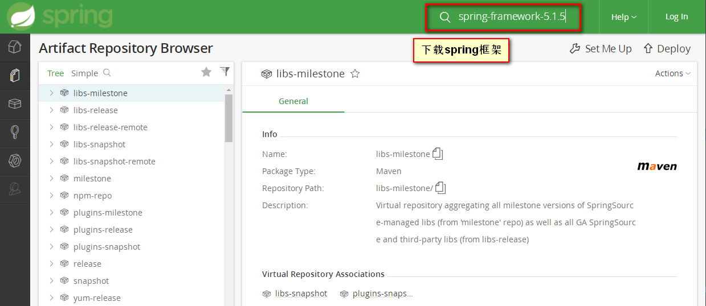

# spring下载
[Spring下载](https://repo.spring.io/webapp/#/artifacts/browse/tree/General/libs-milestone)
***

# spring注意
- spring约束文件[spring-\*.xsd]最好不要指定版本号，使用jar包中的xsd文件
```xsd
<?xml version="1.0" encoding="UTF-8"?>
<beans xmlns="http://www.springframework.org/schema/beans"
       xmlns:xsi="http://www.w3.org/2001/XMLSchema-instance"
       xmlns:context="http://www.springframework.org/schema/context"
       xmlns:mvc="http://www.springframework.org/schema/mvc"
       xmlns:task="http://www.springframework.org/schema/task"
       xsi:schemaLocation="http://www.springframework.org/schema/beans http://www.springframework.org/schema/beans/spring-beans.xsd
        http://www.springframework.org/schema/mvc
        http://www.springframework.org/schema/mvc/spring-mvc.xsd
        http://www.springframework.org/schema/context
        http://www.springframework.org/schema/context/spring-context.xsd
        http://www.springframework.org/schema/task http://www.springframework.org/schema/task/spring-task.xsd">
  </beans>
```
