[toc]
# idea快捷键大全
## 快捷键图示
- Alt+按住右键移动
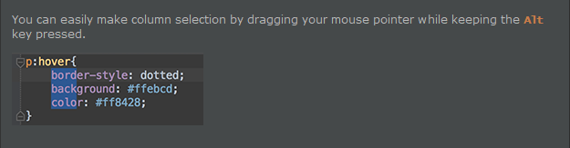
- Alt+up/down
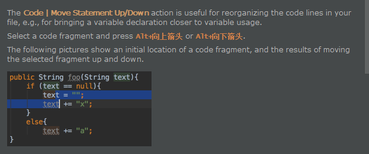
- Alt+Shift+C
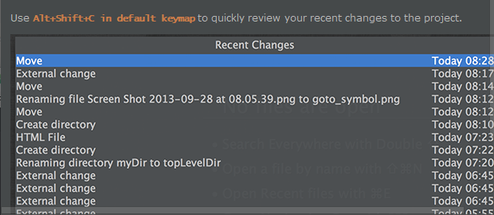
- Ctrl+空格
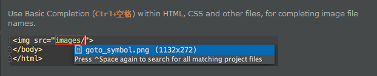
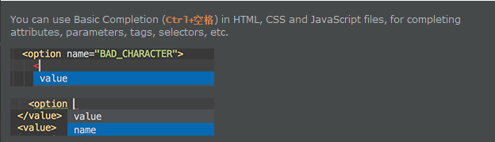
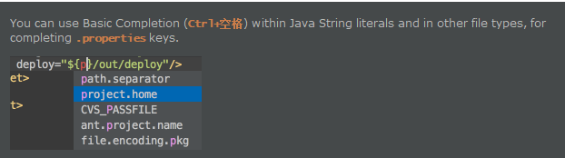
- Ctrl+shift+enter
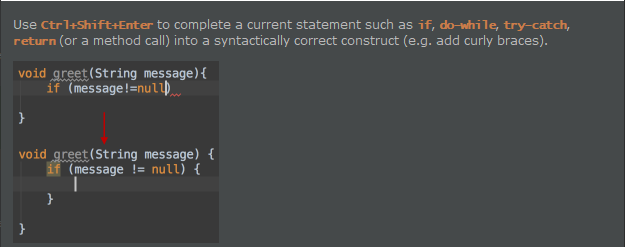
- Ctrl+shift+w
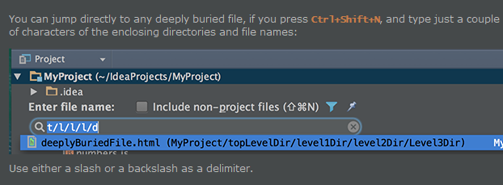
- Ctrl+shift+i
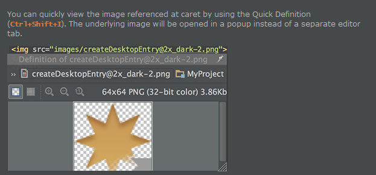
- 选中元素/点击Diagrams
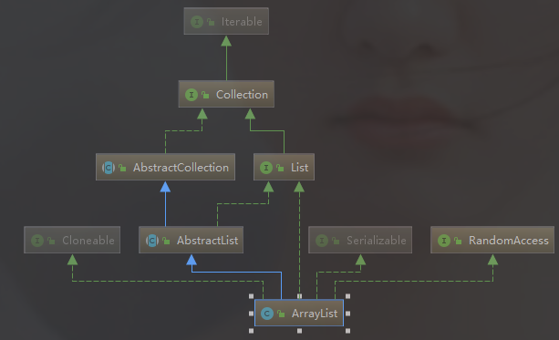
- Ctrl+Alt+H
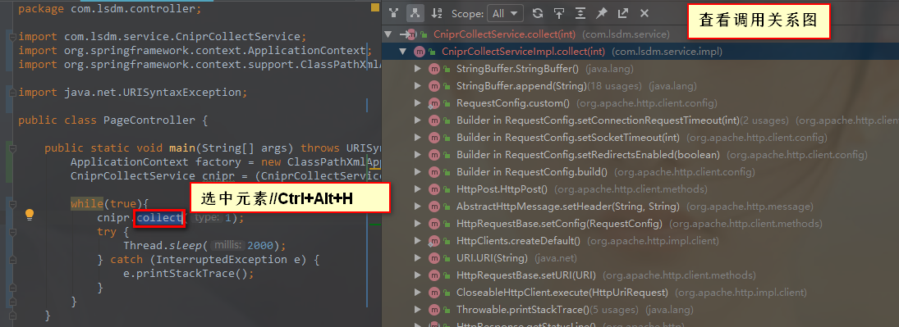
- 右键点击tag
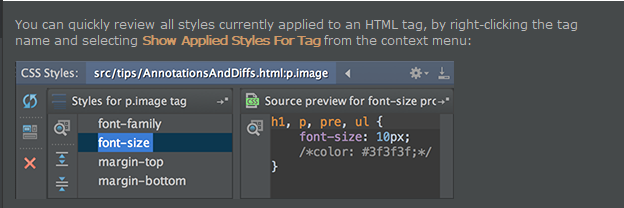
- File/Open

- maven依赖图谱
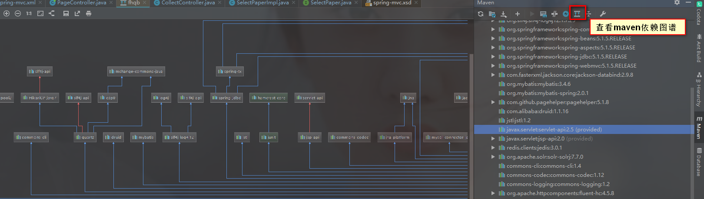
## `常用快捷键`
- `ALT+enter`    导入包,自动修正
- `CTRL+ALT+L`  格式化代码
- `Alt+shift+up/down` 上/下移当前行
- `ctrl+D` 复制当前行到下一行
- `ctrl+Y` 删除当前行
- `Alt+Insert`  生成代码(如get,set方法,构造函数等)或者右键（Generate）
- `Ctrl + O`   重写方法
- `CTRL+空格`   代码提示
- `CTRL+E`      最近更改的代码
- `CTRL+P`   方法参数提示
- `Ctrl+Alt+O`   优化导入的类和包
- `CTRL+ALT+L`  格式化代码
- `Ctrl+Alt+T`  生成try/catch或者Alt+enter
- `Ctrl+Shift+J` 整合两行为一行
- `ALT+鼠标左键` 块编辑
- `SHIFT+ALT+INSERT` 竖编辑模式
- `ALT+ ↑/↓`  在方法间快速移动定位
- `Alt+1` 打开或隐藏工程面板/当前编辑文件定位到目录树
- `ALT+SHIFT+C`  查找修改的文件
- `Ctrl+N`   查找类
- `双击SHIFT` 在项目的所有目录查找文件
- `CTRL+F`   在当前窗口查找文本
- `CTRL+R`   在当前窗口替换文本
- `CTRL+E`   最近打开的文件
## `编辑快捷键`
- `fori/sout/psvm + Tab`
- `CTRL+ALT+ left/right` 前后导航编辑过的地方
- `Alt+Insert`  生成代码(如get,set方法,构造函数等)或者右键（Generate）
- `ALT+enter`    导入包,自动修正  
- `ALT+/`      代码提示
- `ALT+INSERT`  生成代码(如GET,SET方法,构造函数等)
- `Alt+shift+up/down` 上/下移当前行
- `Ctrl+Shift+上/下键` 移动代码
- `Shift+F6`  重构-重命名 (包、类、方法、变量、甚至注释等)
- `Ctrl + O`   重写方法  
- `Ctrl + I` 实现方法
- `CTRL+J`      自动代码
- `CTRL+空格`   代码提示
- `CTRL+E`      最近更改的代码
- `CTRL+P`   方法参数提示  
- `CTRL+Q` 可以看到当前方法的声明/显示注释文档
- `Ctrl+Alt+O`   优化导入的类和包
- `CTRL+ALT+L`  格式化代码  
- `CTRL+ALT+I`  自动缩进  
- `CTRL+ALT+O`  优化导入的类和包
- `Ctrl+Alt+T`  生成try/catch或者Alt+enter
- `CTRL+ALT+T`  把选中的代码放在 TRY{} IF{} ELSE{} 里
- `CTRL+ALT+SPACE`  类名或接口名提示  
- `Ctrl+Alt+V` 提取变量
- `Ctrl+Shift+J` 整合两行为一行
- `Ctr+shift+U` 大小写转化  
- `CTRL+SHIFT+SPACE` 自动补全代码
- `Ctrl+W` 选中代码，连续按会有其他效果
## `查询快捷键`
- `ALT+7`  靠左窗口显示当前文件的结构
- `ALT+F7` 找到你的函数或者变量或者类的所有引用到的地方
- `Alt+F1` 查找代码所在位置
- `Alt+1` 快速打开或隐藏工程面板
- `ALT+ ↑/↓`  在方法间快速移动定位
- `Alt+6`    查找TODO
- `Alt+ left/right` 切换代码视图
- `ALT+SHIFT+C`  查找修改的文件
- `选中文本，按Alt+F3` ，高亮相同文本，F3逐个往下查找相同文本
- `SHIFT+F3`  向上一个关键字出现位置
- `双击SHIFT` 在项目的所有目录查找文件
- `Ctrl+Up/Down` 光标跳转到第一行或最后一行下
- `Ctrl+N`   查找类
- `CTRL+G`   定位行  
- `CTRL+F`   在当前窗口查找文本
- `CTRL+R`   在当前窗口替换文本
- `CTRL+E`   最近打开的文件
- `Ctrl+W` 选中代码，连续按会有其他效果
- `Ctrl+B` 快速打开光标处的类或方法  
- `Ctrl+X` 剪切行
- `Ctrl+D` 复制行
- `Ctrl+/ 或 Ctrl+Shift+/`  注释（// 或者/*...*/ ）
- `Ctrl+H` 显示类结构图
- `Ctrl+Q` 显示注释文档
- `Ctrl+F12` 浮动显示当前文件的结构
- `CTRL+ALT+ left/right` 前后导航编辑过的地方
- `CTRL+ALT+F7`  找到你的函数或者变量或者类的所有引用到的地方
- `CTRL+ALT+B`  找所有的子类
- `Ctrl+Alt+ left/right` 返回至上次浏览的位置
- `CTRL+ALT+ left/right` 前后导航编辑过的地方
- `Ctrl+Shift+Alt+N` 查找类中的方法或变量
- `Ctrl+Shift+N` 查找文件
- `CTRL+SHIFT+F`  在指定窗口查找文本  
- `CTRL+SHIFT+R`  在指定窗口替换文本  
- `CTRL+SHIFT+O`  弹出显示查找内
- `CTRL+SHIFT+B`  找变量的类  
- `Ctrl+Shift+上/下键` 移动代码
- `Ctrl＋Shift＋Backspace` 可以跳转到上次编辑的地方
- `Ctrl＋Shift＋Backspace`可以跳转到上次编辑的地
- `F2 或Shift+F2` 高亮错误或警告快速定位
- `F3`   向下查找关键字出现位置   
- `F4`   查找变量来源
## `其他快捷键`
- `ALT+F1`   查找文件所在目录位置
- `SHIFT+ENTE`R 另起一行
- `SHIFT+ALT+INSERT` 竖编辑模式
- `CTRL+Z`   倒退(撤销)
- `Ctrl+~` 快速切换方案（界面外观、代码风格、快捷键映射等菜单）
- `CTRL+F4`  关闭当前窗口
- `CTRL+ALT+F12`  资源管理器打开文件夹
- `Ctrl+Alt+V` 可以引入变量。例如：new String(); 自动导入变量定义
- `CTRL+SHIFT+Z`  向前(取消撤销)
## `svn快捷键`
- `ctrl+k` 提交代码到SVN
- `ctrl+t` 更新代码
## `调试快捷键`
- `alt+F8`          debug时选中查看值
- `Alt+F9` 运行至光标处
- `Alt+F10` 定位到断点
- `Alt+Shift+F7` 强制步入
- `Alt+Shift+F8` 强制步过
- `Alt+Shift+F9` 选择 Debug
- `Alt+Shift+F10` 选择 Run
- `Shift+F7` 智能步入
- `Shift+F8` 步出
- `Ctrl+Shift+F8` 查看断点
- `Ctrl+Shift+F9` 编译
- `Ctrl+Alt+F9` 强制运行至光标处
- `F7` 步入
- `F8` 步过
- `F9` 恢复程序
## `重构`
- `Alt+Delete` 安全删除
- `Shift+F6` 重命名
- `Ctrl+Alt+N` 内联
- `Ctrl+Alt+Shift+T` 弹出重构菜单
- `F6` 移动
- `F5` 复制

# idea插件
## `Codota`
> 代码收索插件，搜索类似的代码片段

## `SmartIM4IntelliJ`
> SmartIM4IntelliJ 是一个 IntelliJ IDEA 上的 SmartIM（原 SmartQQ）插件，可以在 IDEA 中使用 QQ 或微信聊天

- 功能：
- 收发文本消息
- 收发图片
- 收发文件
- 发送工程中的文件
- Code Review 发送代码位置及评语
- 超链接点击
- 支持图灵机器人接入

## `eprofiler`
> eprofiler是一款开源的IDEA性能分析工具。能够在程序动态运行过程中不影响程序运行，达到对程序进行CPU热点方法的性能分析。
支持版本：目前仅支持MAC操作系统，后期打算覆盖Linux和windows
安装方式：在IDEA插件中选择本地安装即可
运行原理：项目在启动过程中在jvm参数上加载了指定的agent
实现原理：内部agent采用c++实现，和IDEA的火焰图性能分析插件类似

功能：
- 打算在性能分析堆栈树加入代码跳转，点击相关的热点方法即可进入项目中的代码
- 目前是实时分析的，后期会加入项目运行结束查看项目启动过程中的所有分析结果的聚合态
- 支持导出分析结果为火焰图

## `ADB IDEA`
> ADB Idea 是一个适用于 Android Studio 和 Intellij IDEA 的 Android 开发插件，可显著提升开发效率。
在进行 Android 开发调试的时候，经常需要把当前项目 app 的数据清空，以测试用户第一次打开 app 时的情况。
通常我们需要在设置里面通过好几步繁琐的操作才能完成。特别是在测试机器里面，因为 demo 太多，要找到自己的 app 很难。而 ADB IDEA 的出现很好地解决了该问题。

功能：
- Kill App
- Start App
- Restart App
- Clear App Data
- Clear App Data and Restart

## `EasyCode`
> EasyCode是基于IntelliJ IDEA开发的代码生成插件，支持自定义任意模板（Java，html，js，xml）。只要是与数据库相关的代码都可以通过自定义模板来生成。支持数据库类型与java类型映射关系配置。支持同时生成生成多张表的代码。每张表有独立的配置信息。完全的个性化定义，规则由你设置。

支持的数据库：
- MySQL
- SQL Server
- Oracle
- PostgreSQL
- Sqlite
- Sybase
- Derby
- DB2
- HSQLDB
- H2

功能说明

## `Code Iris`
[Code Iris网址](www.codeiris.com)
- 功能：
- 解析groovy和java源代码
- 可视化模块及其依赖项
- 可视化类及其依赖项
- 可视化包及其类
- 过滤类和包
- 突出显示类和包
- 基本结构指标
- 手动布局
- 基于依赖关系的有机布局
- 从类导航到类
